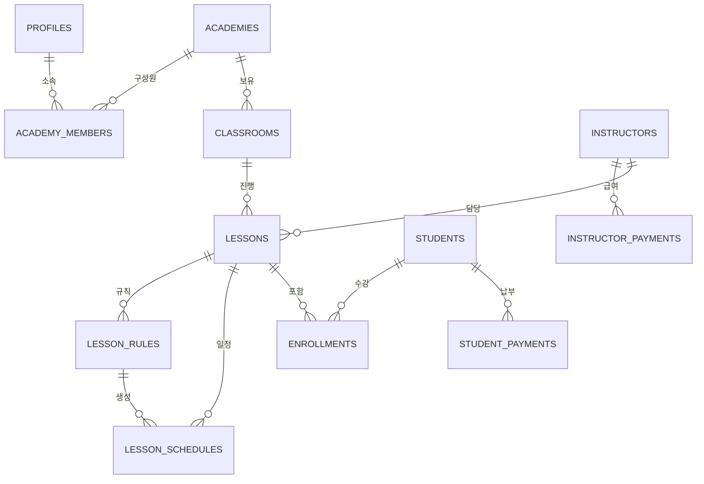

# CONTEXT

Electron + TypeScript 데스크탑 학원 관리 앱.  
Renderer는 React SPA (Zustand + shadcn/ui), Backend는 **Supabase Cloud** (PostgreSQL + Auth + RLS).

> **마지막 업데이트**: 2026-02-02  
> **주요 변경사항**: 탭 간 데이터 동기화 수정 (이벤트 스코프 정리)

---

## 📋 CHANGELOG (최근 변경 이력)

### 2026-02-02 - 탭 간 데이터 동기화 수정
- **이벤트 스코프 정리**: 데이터 변경 시 모든 관련 탭이 갱신되도록 `onDataChange` 리스너 확장
  - `InstructorList.tsx`: `lessons` 스코프 추가 (수업 편집 시 강사 탭 갱신)
  - `StudentList.tsx`: `lessons`, `general` 스코프 추가 (수업 변경/초기화 시 학생 탭 갱신)
  - `ClassroomsPage.tsx`: `classrooms`, `general` 스코프 추가 (강의실 변경/초기화 시 시간표 갱신)
  - `AccountingStats.tsx`: `students`, `instructors`, `general` 스코프 추가
  - `StudentPayment.tsx`: `students`, `general` 스코프 추가
  - `PayrollManager.tsx`: `instructors`, `lessons`, `general` 스코프 추가
  - `TaxCalculator.tsx`: `general` 스코프 추가
- **포인터 캡처 안전화**: `safeSetPointerCapture` 적용 및 `pointer-safety` 개선으로 input 포커스 이슈 완화


### 2026-02-01 (저녁) - Result 패턴 및 UI 컴포넌트 개선
- **Result 패턴 도입**: 모든 API 함수가 `Result<T>` 타입 반환
  - `ok()`, `err()`, `wrapAsync()` 헬퍼 함수 추가 (`core/api/shared/result.ts`)
  - 호출부 18개 파일에서 `result.success` 체크 패턴 적용
- **UI 컴포넌트 개선**:
  - `skeleton.tsx`: variant prop 확장 (default/text/card/table/avatar/list), `SkeletonList` 추가
  - `InlineError.tsx`: 인라인 에러 표시 컴포넌트 신규 (default/subtle/minimal variant)
  - `ErrorBoundary.tsx`: 한국어 UI, 리셋 기능, 세부정보 접기/펴기 추가

### 2026-02-01 (오후)
- **API 모듈 분리**: 단일 `api.ts` (2648줄) → 12개 도메인별 모듈로 분리
  - `classrooms.ts`, `lessons.ts`, `schedules.ts`, `students.ts`, `instructors.ts` 등
  - `shared/` 폴더에 `normalizers.ts`, `types.ts`, `errorHandler.ts` 생성
- **타입 안전성 개선**: 6개 API 파일에서 22개 `any` 타입 제거
- **로깅 표준화**: `console.log` → 중앙 `logger.ts` 유틸리티로 교체 (31개)
- **성능 최적화**: 
  - `listScheduleLessons()`: 순차 쿼리 → `Promise.all` 병렬 실행
  - `LessonBlock.tsx`: `React.memo` 적용으로 불필요한 리렌더링 방지

### 2026-02-01
- **PIN 잠금 화면 구현**: 비활성 감지 + PIN 입력 잠금 (5/10/15/30분 선택 가능)
- **위험 작업 비밀번호 확인**: 데이터 초기화 시 비밀번호 재입력 필수
- **보안 컴포넌트 추가**: `PinLockScreen`, `PinSetupDialog`, `PasswordConfirmDialog`
- **설정 패널 확장**: PIN 설정/변경/삭제 UI, 타임아웃 설정, "지금 잠금" 버튼

### 2026-01-31
- **프로젝트 문서화 업데이트**: CONTEXT.md 전면 개정, DATABASE_SCHEMA.md 통합
- **DB 정리**: `meta` 테이블 삭제 (SQLite 레거시, Supabase 불필요)
- **미사용 파일 정리**: 레거시 코드 제거 완료
- **UI 개선**: 홈 대시보드 '오늘 수업' 카드 디자인 개선, 학생 배정 탭 1:2:2 레이아웃
- **버그 수정**: 강사 캘린더 로직, 학생 검색 오류, 모달 포커스 버그

---

## 1. TECH STACK

| 분류              | 스택                    | 버전/설명                         |
| ----------------- | ----------------------- | --------------------------------- |
| **Core**          | React                   | ^19.2.3                           |
|                   | React DOM               | ^19.2.3                           |
|                   | Zustand                 | ^5.0.10 (상태 관리)               |
| **Electron**      | Electron                | ^30.0.0                           |
|                   | Main                    | `main.ts`                         |
|                   | Preload                 | `preload.ts`                      |
| **TypeScript**    | TypeScript              | ^5.4.5                            |
|                   | Main/Preload/Backend    | tsc 컴파일                        |
|                   | Renderer                | esbuild 번들링                    |
| **Styling**       | TailwindCSS             | ^3.4.17                           |
|                   | tailwindcss-animate     | ^1.0.7                            |
|                   | Fonts                   | Noto Sans KR (@fontsource)        |
| **DB**            | @supabase/supabase-js   | ^2.93.3 (PostgreSQL Cloud + Auth) |
| **UI Components** | shadcn/ui               | `@/components/ui/*`               |
|                   | Radix UI                | Dialog, Select, Tabs, Switch 등   |
|                   | Lucide React            | ^0.563.0 (아이콘)                 |
|                   | Sonner                  | ^2.0.7 (Toast)                    |
|                   | Framer Motion           | ^12.29.2 (애니메이션)             |
| **Performance**   | @tanstack/react-virtual | ^3.13.18 (리스트 가상화)          |
| **Build**         | esbuild                 | ^0.27.2                           |
|                   | electron-builder        | ^26.4.0                           |
|                   | electron-rebuild        | ^3.2.9                            |
| **Testing**       | Vitest                  | ^4.0.18                           |
|                   | @testing-library/react  | ^16.3.2                           |
|                   | jsdom                   | ^27.4.0                           |

---

## 2. PROJECT STRUCTURE

```
C:\gdrive\codes\lms
├── main.ts                  # Electron 메인 프로세스
├── preload.ts               # IPC 브릿지 (contextBridge) - 레거시
├── package.json             # 의존성 및 스크립트
├── tsconfig.json            # TypeScript 설정 (main/preload)
├── tsconfig.renderer.json   # Renderer TypeScript 설정
├── tailwind.config.js       # TailwindCSS 설정
├── vitest.config.ts         # Vitest 테스트 설정
├── components.json          # shadcn/ui 설정
│
├── renderer/                # Renderer UI
│   ├── index.html            # SPA 엔트리 HTML
│   ├── bundle.js             # esbuild 출력 (빌드 결과물)
│   ├── styles/
│   │   ├── tailwind.css       # TailwindCSS 입력
│   │   ├── tailwind.out.css   # TailwindCSS 출력
│   │   └── files/             # 폰트 파일 (Noto Sans KR)
│   └── js/
│       ├── App.tsx            # 메인 앱 컴포넌트 (라우팅 + 인증)
│       ├── main.tsx           # 엔트리 포인트
│       ├── pointer-safety.ts  # 포인터 캡처 안전 유틸 (input 포커스 버그 방지)
│       │
│       ├── components/        # React 컴포넌트
│       │   ├── ui/             # shadcn/ui 공통 컴포넌트 (15개)
│       │   │   ├── button.tsx
│       │   │   ├── dialog.tsx
│       │   │   ├── context-menu.tsx
│       │   │   ├── tabs.tsx
│       │   │   ├── select.tsx
│       │   │   └── ...
│       │   ├── layout/         # Sidebar 등 레이아웃
│       │   ├── ErrorBoundary.tsx
│       │   │
│       │   ├── lessons/        # 시간표, 강의실 관련 (11개)
│       │   │   ├── TimetableGrid.tsx     # 시간표 그리드 (37KB)
│       │   │   ├── ClassroomBoard.tsx    # 강의실 도면 SVG (21KB)
│       │   │   ├── LessonDialog.tsx      # 수업 편집 다이얼로그
│       │   │   ├── LessonStudentDialog.tsx # 학생 배정 다이얼로그
│       │   │   ├── LessonCancelDialog.tsx  # 휴강 처리
│       │   │   ├── SubstituteDialog.tsx    # 대타 강사 설정
│       │   │   ├── PeriodCancelDialog.tsx  # 기간 휴강
│       │   │   ├── MakeupDialog.tsx        # 보강 수업 추가
│       │   │   ├── MiniTimetable.tsx       # 미니 시간표 뷰
│       │   │   └── MultiView.tsx           # 강의실 카드 뷰
│       │   │
│       │   ├── people/         # 학생, 강사 관련 (12개)
│       │   │   ├── StudentList.tsx
│       │   │   ├── InstructorList.tsx
│       │   │   ├── students/        # 학생 서브 컴포넌트 (6개)
│       │   │   └── instructors/     # 강사 서브 컴포넌트 (4개)
│       │   │
│       │   ├── accounting/     # 회계 관련 (7개)
│       │   ├── home/           # 홈 대시보드 (1개)
│       │   ├── settings/       # 설정 관련 (1개)
│       │   ├── security/       # 보안 관련 (3개) ★ 신규
│       │   │   ├── PinLockScreen.tsx     # PIN 입력 잠금 화면
│       │   │   ├── PinSetupDialog.tsx    # PIN 설정/변경/삭제
│       │   │   └── PasswordConfirmDialog.tsx # 위험작업 비밀번호 확인
│       │   │
│       │   └── [기타 도메인]/   # 미래 확장용
│       │       ├── attendance/
│       │       ├── classroom/
│       │       ├── instructor/
│       │       ├── shared/
│       │       ├── sms/
│       │       ├── student/
│       │       └── timetable/
│       │
│       ├── contexts/          # React Context
│       │   └── AuthContext.tsx  # 인증 상태 관리 ★ 신규
│       │
│       ├── pages/             # 페이지 컴포넌트
│       │   ├── LoginPage.tsx    # 로그인 페이지 ★ 신규
│       │   └── ClassroomsPage.tsx
│       │
│       ├── stores/            # Zustand 스토어
│       │   ├── lessonStore.ts    # 수업/스케줄 상태
│       │   ├── classroomStore.ts # 강의실 상태
│       │   └── accountingStore.ts # 회계 상태
│       │
│       ├── core/              # 공유 유틸리티
│       │   ├── supabaseClient.ts  # Supabase 클라이언트 ★ 신규
│       │   ├── api.ts             # Supabase API 래퍼 (82KB, 2648 lines)
│       │   ├── types.ts           # 타입 정의 (13KB)
│       │   ├── theme.ts           # 디자인 시스템 토큰
│       │   ├── constants.ts       # 상수
│       │   ├── events.ts          # 이벤트 유틸리티
│       │   ├── lessonColors.ts    # 수업 색상 시스템
│       │   ├── hooks/             # 커스텀 훅
│       │   │   └── useIdleTimer.ts  # 비활성 감지 훅 ★ 신규
│       │   └── utils/             # 날짜/시간/DOM 유틸
│       │
│       ├── lib/
│       │   └── utils.ts        # cn() 클래스 병합 유틸
│       │
│       ├── hooks/             # 커스텀 훅
│       ├── modules/           # 모듈 (서비스별 로직)
│       ├── services/          # 서비스 계층
│       ├── state/             # 상태 관리 유틸
│       └── test/              # 테스트 설정
│           └── setup.ts        # Vitest 셋업
│
├── src/                     # Backend (Main Process) - ⚠️ 레거시
│   ├── handlers/             # IPC 핸들러 (사용 안 함)
│   ├── repositories/         # SQLite 쿼리 계층 (사용 안 함)
│   └── services/             # 비즈니스 로직 계층 (사용 안 함)
│
├── planning/                # 개발 문서
│   ├── supabase_migration_plan.md    # 마이그레이션 계획서 ★
│   ├── todo.md                        # 할 일 목록
│   └── [기타 계획 문서]
│
├── scripts/                 # 스크립트
│   └── copy-fonts.js        # 폰트 파일 복사
│
├── build/                   # 빌드 리소스 (아이콘 등)
├── dist/                    # tsc 컴파일 출력
└── release/                 # electron-builder 출력
```

> ⚠️ **Note**: `src/` 디렉토리의 IPC 핸들러와 Repository는 Supabase 마이그레이션 후 사용되지 않습니다. 추후 정리 예정.

---

## 3. ARCHITECTURE

### 3.1 데이터 흐름 (Supabase Cloud)

```
┌─────────────────────────────────────────────────────────────────┐
│                        Frontend (React)                         │
├─────────────────────────────────────────────────────────────────┤
│  AuthProvider (React Context)                                   │
│  ├── 로그인 상태 관리 (useAuth hook)                            │
│  ├── 세션 토큰 저장 (Supabase 관리)                             │
│  └── 인증 필요 라우트 보호                                      │
├─────────────────────────────────────────────────────────────────┤
│  Supabase Client (renderer/js/core/supabaseClient.ts)           │
│  ├── @supabase/supabase-js                                      │
│  ├── RLS 정책으로 데이터 접근 제어                              │
│  └── 멀티테넌시: 학원(academy_id) 기반 데이터 분리              │
├─────────────────────────────────────────────────────────────────┤
│  API Layer (renderer/js/core/api.ts)                            │
│  ├── 121개 함수 (Supabase 쿼리 래퍼)                            │
│  └── 기존 window.api 호환 shim 제공                             │
└─────────────────────────────────────────────────────────────────┘
                              │
                              ▼
┌─────────────────────────────────────────────────────────────────┐
│                    Supabase (Cloud)                             │
├─────────────────────────────────────────────────────────────────┤
│  Auth: 이메일/비밀번호 인증                                     │
│  Database: PostgreSQL + RLS                                     │
│  ├── profiles (사용자 정보 + 역할 + 현재 학원)                  │
│  ├── academies (학원 정보)                                      │
│  ├── academy_members (사용자-학원 연결)                         │
│  └── 기존 비즈니스 테이블 (academy_id로 분리)                   │
└─────────────────────────────────────────────────────────────────┘
```

### 3.2 인증 시스템

| 파일                | 역할                                                             |
| ------------------- | ---------------------------------------------------------------- |
| `AuthContext.tsx`   | React Context로 인증 상태 관리 (user, session, profile, loading) |
| `supabaseClient.ts` | Supabase 클라이언트 초기화 (.env에서 URL/Key 로드)               |
| `LoginPage.tsx`     | 로그인/회원가입 UI (10KB)                                        |

**주요 기능:**
- `signIn(email, password)`: 로그인
- `signOut()`: 로그아웃
- `signUp(email, password, metadata)`: 회원가입
- `useAuth()`: 인증 상태 접근 훅

**인증 흐름:**
```
1. 앱 시작 → LoginPage 표시 (미인증)
2. 로그인 성공 → AuthContext에 user/session 저장
3. 프로필 로드 → profiles 테이블에서 role/current_academy_id 조회
4. 메인 앱 렌더링 (AuthenticatedApp: Sidebar + 콘텐츠)
5. 비활성 감지 → PIN 설정 시 잠금 화면 표시 (★ 신규)
```

### 3.3 PIN 잠금 시스템 (신규)

| 파일                        | 역할                                           |
| --------------------------- | ---------------------------------------------- |
| `useIdleTimer.ts`           | 비활성 감지 훅 (mouse, keyboard, touch 이벤트) |
| `PinLockScreen.tsx`         | PIN 입력 잠금 화면 UI                          |
| `PinSetupDialog.tsx`        | PIN 설정/변경/삭제 다이얼로그                  |
| `PasswordConfirmDialog.tsx` | 위험 작업 전 비밀번호 재확인                   |

**PIN 흐름:**
```
1. 설정에서 PIN 설정 (4자리 이상)
2. PIN은 SHA-256 해시로 profiles.pin_hash에 저장
3. 비활성 타임아웃 (5/10/15/30분) 도달 시 잠금
4. "지금 잠금" 버튼으로 즉시 잠금 가능
5. 올바른 PIN 입력 시 잠금 해제
```

### 3.4 멀티테넌시 (학원 분리)

- 모든 비즈니스 테이블에 `academy_id` 컬럼 추가
- RLS 정책: `belongs_to_current_academy(academy_id)` 함수로 접근 제어
- 사용자는 여러 학원에 소속 가능 (`academy_members`)
- 현재 활성 학원은 `profiles.current_academy_id`에 저장

### 3.5 레이어 구조

```
React Component → Zustand Store → api.ts → Supabase Client → PostgreSQL
                                              │
                                              └── RLS Policy (academy_id 필터링)
```

---

## 4. API LAYER (core/api.ts)

### 4.1 API 구조 (82KB, 2648 lines, 121 functions)

| 카테고리       | 주요 함수                                                                                   |
| -------------- | ------------------------------------------------------------------------------------------- |
| **Classroom**  | `listClassrooms`, `createClassroom`, `updateClassroomRect`, `deleteClassroom`               |
| **Lesson**     | `listLessons`, `listScheduleLessons`, `createLesson`, `updateLesson`, `deleteLesson`        |
| **Schedule**   | `createSchedule`, `cancelSchedule`, `setSubstituteInstructor`, `cancelSchedulesByDateRange` |
| **Student**    | `listStudents`, `createStudent`, `updateStudent`, `deleteStudent`                           |
| **Instructor** | `listInstructors`, `createInstructor`, `updateInstructor`, `deleteInstructor`               |
| **Enrollment** | `createEnrollment`, `deleteEnrollment`, `listEnrollmentsByLesson`                           |
| **Accounting** | `listStudentPayments`, `listInstructorPayments`, `listExpenses`, `listOtherIncome`          |
| **Settings**   | `getSettings`, `updateSettings`                                                             |

### 4.2 주요 타입 (core/types.ts)

```typescript
interface Classroom { id, academy_id, name, x, y, width, height, color }
interface Lesson { id, classroomId, title, instructor, instructorId, courseId, note }
interface ScheduleLesson extends Lesson { scheduleId, date, startTime, endTime, status }
interface Student { id, name, phone, email, schoolType, grade, status }
interface Instructor { id, firstName, lastName, email, phone, hourlyRate, status }
interface Profile { id, email, full_name, role: 'admin'|'instructor'|'staff' }
```

---

## 5. COMPONENT PATTERNS

### 5.1 앱 라우팅 (App.tsx)

```tsx
// 인증 래핑 구조
<AuthProvider>
  <AppContent>
    {loading ? <LoadingSpinner /> :
     !user ? <LoginPage /> :
     <AuthenticatedApp />}
  </AppContent>
</AuthProvider>

// 페이지 라우팅 (switch문)
case 'home': return <HomeDashboard onNavigate={setActivePage} />;
case 'classrooms': return <ClassroomsPage />;
case 'instructors': return <InstructorList />;
case 'students': return <StudentList />;
case 'accounting': return <AccountingMain />;
case 'settings': return <SettingsPanel />;
```

### 5.2 상태 관리 (Zustand)

```typescript
// 패턴: Record<id, T> 사용 (직렬화 호환)
interface LessonState {
  lessons: Record<number, ScheduleLesson>;  // ✓ (Map 대신)
  conflicts: Record<number, boolean>;       // ✓ (Set 대신)
}

// 사용 예
const lessons = useLessonStore(state => state.lessons);
const addLesson = useLessonStore(state => state.addLesson);
```

**스토어 목록:**
| 스토어            | 역할                    |
| ----------------- | ----------------------- |
| `lessonStore`     | 수업, 스케줄, 충돌 감지 |
| `classroomStore`  | 강의실, 선택, 편집 모드 |
| `accountingStore` | 회계 탭, 조회 월        |

### 5.3 Context Menu (우클릭 메뉴)

```tsx
import { ContextMenu, ContextMenuItem, ContextMenuSeparator } from '@/components/ui/context-menu';

<ContextMenu open={!!contextMenu} x={contextMenu?.x ?? 0} y={contextMenu?.y ?? 0} onClose={closeContextMenu}>
  <ContextMenuItem icon={<Users className="w-4 h-4" />} label="학생 관리" onClick={handleStudentManage} />
  <ContextMenuSeparator />
  <ContextMenuItem icon={<Edit className="w-4 h-4" />} label="수업 편집" onClick={handleEdit} />
</ContextMenu>
```

**특징:**
- Notion/Linear 스타일 디자인
- 뷰포트 경계 인식 (화면 밖으로 나가지 않음)
- 스크롤 시 자동 닫힘, ESC 키 또는 외부 클릭으로 닫기

---

## 6. STYLING

### 6.1 Design System (`core/theme.ts`)

```typescript
import { colors, componentStyles } from '@/core/theme';

// 색상 사용
colors.primary.DEFAULT  // #1f9d57
colors.primary.soft     // #d6f1e2
colors.danger.DEFAULT   // #d95b5b

// 컴포넌트 스타일 사용
componentStyles.badge.success    // 'bg-green-100 text-green-800...'
componentStyles.timetableBlock.normal  // 'bg-[#d6f1e2] border-l-[#1f9d57]'
```

### 6.2 CSS Variables

```css
:root {
  /* Legacy hex colors */
  --bg: #f7f8f7;
  --accent: #1f9d57;
  --accent-strong: #138a48;
  --accent-soft: #d6f1e2;
  --danger: #d95b5b;
  
  /* shadcn/ui HSL 변수 */
  --primary: 146.7 67.4% 36.9%;      /* #1f9d57 */
  --primary-soft: 147 56% 90%;       /* #d6f1e2 */
  --primary-strong: 147 76% 31%;     /* #138a48 */
}
```

### 6.3 shadcn/ui 컴포넌트 (15개)

```
components/ui/
├── button.tsx        # 버튼 (variant: default, outline, destructive, ghost)
├── card.tsx          # 카드 컨테이너
├── checkbox.tsx      # 체크박스
├── context-menu.tsx  # 우클릭 컨텍스트 메뉴
├── dialog.tsx        # 다이얼로그 모달
├── input.tsx         # 텍스트 입력
├── label.tsx         # 레이블
├── select.tsx        # 선택 드롭다운
├── separator.tsx     # 구분선
├── skeleton.tsx      # 스켈레톤 로딩
├── sonner.tsx        # Toast 알림
├── switch.tsx        # 토글 스위치
├── tabs.tsx          # 탭 UI
└── textarea.tsx      # 멀티라인 텍스트
```

---

## 7. DATABASE (Supabase PostgreSQL)

> **총 19개 테이블** | RLS 정책 적용 | 멀티테넌시 (academy_id 기반)

### 7.1 인증/멀티테넌시 테이블

| 테이블              | 주요 컬럼                                                                                               | 설명             |
| ------------------- | ------------------------------------------------------------------------------------------------------- | ---------------- |
| **profiles**        | `id` (UUID, FK→auth.users), `email`, `full_name`, `role` (admin/instructor/staff), `current_academy_id` | 사용자 프로필    |
| **academies**       | `id`, `name`, `owner_id` (FK→auth.users), `created_at`                                                  | 학원 정보        |
| **academy_members** | `id`, `academy_id`, `user_id`, `role` (owner/admin/instructor/staff)                                    | 사용자-학원 연결 |

### 7.2 핵심 비즈니스 테이블

| 테이블               | 주요 컬럼                                                                                                                        | 설명                |
| -------------------- | -------------------------------------------------------------------------------------------------------------------------------- | ------------------- |
| **classrooms**       | `id`, `academy_id`, `name`, `x`, `y`, `width`, `height`, `color`                                                                 | 강의실 배치         |
| **lessons**          | `id`, `academy_id`, `classroom_id`, `title`, `instructor`, `instructor_id`, `course_id`, `note`, `status`                        | 수업 기본 정보      |
| **lesson_rules**     | `id`, `lesson_id`, `day` (0-6), `start_slot`, `end_slot`, `start_date`, `end_date`, `active`                                     | 정규 수업 반복 규칙 |
| **lesson_schedules** | `id`, `lesson_id`, `rule_id`, `date`, `start_time`, `end_time`, `status`, `substitute_instructor_id`, `cancel_reason`            | 실제 수업 일정      |
| **students**         | `id`, `academy_id`, `name`, `phone`, `email`, `school_type`, `grade`, `status`, `parent_name`, `parent_phone`, `monthly_tuition` | 학생 정보           |
| **instructors**      | `id`, `academy_id`, `first_name`, `last_name`, `email`, `phone`, `hourly_rate`, `status`                                         | 강사 정보           |
| **courses**          | `id`, `academy_id`, `code`, `title`, `description`, `fee`, `status`                                                              | 과정/교과목 (옵션)  |
| **enrollments**      | `id`, `academy_id`, `student_id`, `lesson_id`, `enrollment_date`, `status`                                                       | 학생-수업 연결      |

### 7.3 회계 테이블

| 테이블                  | 주요 컬럼                                                                                 | 설명        |
| ----------------------- | ----------------------------------------------------------------------------------------- | ----------- |
| **student_payments**    | `id`, `academy_id`, `student_id`, `amount`, `payment_date`, `payment_method`, `status`    | 학생 수납   |
| **instructor_payments** | `id`, `academy_id`, `instructor_id`, `amount`, `payment_date`, `work_hours`, `status`     | 강사 급여   |
| **expenses**            | `id`, `academy_id`, `amount`, `expense_date`, `category`, `payment_method`, `description` | 기타 지출   |
| **other_income**        | `id`, `academy_id`, `amount`, `income_date`, `category`, `description`                    | 기타 수입   |
| **settings**            | `key`, `value`, `academy_id`                                                              | 학원별 설정 |

### 7.4 복식회계 테이블 (미사용, 향후 확장용)

| 테이블                | 설명                                               |
| --------------------- | -------------------------------------------------- |
| **account_types**     | 계정 과목 (revenue/expense/asset/liability/equity) |
| **transactions**      | 거래 기록                                          |
| **transaction_lines** | 거래 상세 (차변/대변)                              |

### 7.5 테이블 관계도



### 7.6 중요 컬럼 값 (Enum)

```
status (lessons/students/instructors): active, inactive, on_leave, graduated, dropped
status (lesson_schedules): scheduled, completed, cancelled, makeup, substituted
payment_method: cash, card, bank_transfer, check, zeropay, other
school_type: elementary, middle, high, etc.
role (profiles/academy_members): admin, instructor, staff, owner
```

---

## 8. DEVELOPMENT RULES

### 8.1 새 페이지 추가

1. `renderer/js/pages/` 또는 `components/` 에 컴포넌트 생성
2. `App.tsx`의 `renderContent()` switch에 케이스 추가
3. `Sidebar.tsx`의 `navItems`에 네비게이션 항목 추가

### 8.2 새 API 함수 추가

```typescript
// core/api.ts에 추가
export async function newApiFunction(params: T): Promise<R> {
  const { data, error } = await supabase
    .from('table_name')
    .select('*')
    .eq('column', params.value);
  
  if (error) throw error;
  return data;
}
```

### 8.3 shadcn/ui 컴포넌트 추가

```bash
npx shadcn@latest add [component-name]
# 예: npx shadcn@latest add alert-dialog
```

### 8.4 새 컴포넌트 패턴

```typescript
// 1. shadcn/ui 사용
import { Button } from '@/components/ui/button';
import { Dialog, DialogContent } from '@/components/ui/dialog';

// 2. Tailwind 클래스
<div className="flex items-center gap-4 p-6">

// 3. 상태 접근
const lessons = useLessonStore(state => state.lessons);
const { user, profile } = useAuth();

// 4. API 호출
import * as api from '@/core/api';
const students = await api.listStudents();
```

---

## 9. TESTING

### 9.1 설정
- **프레임워크**: Vitest + React Testing Library
- **환경**: jsdom
- **설정 파일**: `vitest.config.ts`
- **셋업**: `renderer/js/test/setup.ts`

### 9.2 테스트 파일

| 파일                     | 테스트 대상         |
| ------------------------ | ------------------- |
| `lessonStore.test.ts`    | Zustand 스토어 로직 |
| `TimetableGrid.test.tsx` | 시간표 컴포넌트     |
| `date.test.ts`           | 날짜 유틸리티       |

### 9.3 실행 명령어

```bash
npm test              # Watch 모드
npm run test:coverage # 커버리지 포함
```

---

## 10. BUILD & SCRIPTS

### 10.1 개발

```bash
npm run dev           # 핫 리로드 개발 모드 (main + renderer + css + electron)
npm run dev:main      # Main 프로세스만 watch
npm run dev:renderer  # Renderer만 watch
npm run dev:css       # TailwindCSS watch
```

### 10.2 빌드

```bash
npm run build          # Main + Renderer 빌드
npm run build:main     # tsc (main/preload)
npm run build:renderer # esbuild + tailwindcss (renderer)
npm run copy:fonts     # 폰트 파일 복사
```

### 10.3 배포

```bash
npm run dist       # 플랫폼 감지 후 패키징
npm run dist:win   # Windows portable
npm run dist:mac   # macOS universal
```

---

## 11. PATH ALIASES

| 별칭           | 실제 경로                 |
| -------------- | ------------------------- |
| `@`            | `renderer/js/`            |
| `@/components` | `renderer/js/components/` |

```typescript
import { Button } from '@/components/ui/button';
import { useLessonStore } from '@/stores/lessonStore';
import { useAuth } from '@/contexts/AuthContext';
```

---

## 12. TROUBLESHOOTING

### 12.1 Input/Textarea 클릭 불가 버그

**증상**: 가끔 input 필드를 클릭해도 포커스되지 않고 입력이 안 됨

**원인**: 
- 드래그/리사이즈 중 포인터 캡처(`setPointerCapture`)가 제대로 해제되지 않음
- 남은 포인터 캡처가 모든 클릭 이벤트를 가로챔

**해결책**:
1. **자동 해결** (개선됨): `safeSetPointerCapture` 적용 + `pointer-safety.ts`가 `pointerdown`에서 자동으로 포인터 캡처 해제
2. **수동 해결**: ESC 키 누르기 또는 앱 재시작

### 12.2 빌드 에러

```bash
# 클린 빌드
npm run clean && npm run build
```

### 12.3 타입 에러

```bash
npx tsc --noEmit
```

### 12.4 인증 문제

- **세션 만료**: Supabase 세션 자동 갱신됨, 문제 시 로그아웃 후 재로그인
- **RLS 에러**: 프로필의 `current_academy_id` 설정 확인

---

## 13. TODO / 남은 작업


---

## 14. GUIDELINES

### 개발 원칙
- **빌드 검증**: 코드 수정 후 항상 `npm run build` 실행하여 에러 확인
- **타입 안전성**: `any` 사용 최소화, 명시적 타입 정의
- **일관성**: 기존 패턴 (Store, Component, API) 따르기
- **테스트**: 핵심 로직에 대한 테스트 작성
- **문서화**: 주요 변경 시 CONTEXT.md 및 planning 문서 업데이트
- **인증 필수**: 모든 데이터 접근은 인증된 사용자만 가능 (RLS)
- **academy_id**: 새 테이블/데이터 생성 시 반드시 academy_id 포함

### UI 컴포넌트 규칙
> **항상 shadcn/ui 컴포넌트를 우선 사용**

| 상황       | ❌ 사용 금지               | ✅ 사용 권장                                             |
| ---------- | ------------------------- | ------------------------------------------------------- |
| 버튼       | `<button>`                | `<Button>` from `@/components/ui/button`                |
| 입력       | `<input>`                 | `<Input>` from `@/components/ui/input`                  |
| 선택       | `<select>`                | `<Select>` from `@/components/ui/select`                |
| 체크박스   | `<input type="checkbox">` | `<Checkbox>` from `@/components/ui/checkbox`            |
| 텍스트영역 | `<textarea>`              | `<Textarea>` from `@/components/ui/textarea`            |
| 라디오     | `<input type="radio">`    | `<RadioGroup>` from `@/components/ui/radio-group`       |
| 대화상자   | 직접 구현                 | `<Dialog>` from `@/components/ui/dialog`                |
| 확인창     | `window.confirm()`        | `<ConfirmDialog>` from `@/components/ui/confirm-dialog` |
| 알림       | `window.alert()`          | `toast()` from `sonner`                                 |

**이유:**
1. 다크모드/테마 일관성 보장
2. 접근성 (a11y) 자동 지원
3. 디자인 시스템 통일
4. 반응형 스타일 자동 적용
