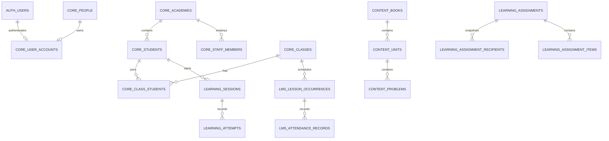

# NEXTUM 공유 데이터베이스 구조

이 문서는 현재 NEXTUM LMS가 사용하는 Supabase PostgreSQL 구조를 요약한다.
Electron/SQLite 파일은 현재 런타임이나 데이터 원본이 아니다. 실제 스키마의
단일 원본은 이 저장소의 `supabase/migrations/`이며, 적용 순서는 파일명의
타임스탬프 순서다.

## 소유권과 원칙

- NEXTUM LMS 저장소가 공유 DB의 DDL, migration, RLS, Data API 노출 설정을
  단독으로 소유한다.
- Grade App은 승인된 `core`, `content`, `learning`, `ai`,
  `reporting` 계약을 소비하며 별도 DDL을 적용하지 않는다.
- 사람/계정과 학생 업무 ID는 분리한다. `auth.users.id`는 인증 ID이고,
  학습·수업·과제의 기준 학생 ID는 `core.students.id`다.
- 모든 학원 운영 데이터는 `academy_id`로 tenant 범위를 가진다.
- 브라우저는 publishable key만 사용한다. secret/service-role key는
  Route Handler와 서버 전용 모듈에서만 사용한다.

## 스키마 지도

| 스키마 | 역할 | 대표 객체 |
| --- | --- | --- |
| `core` | 학원, 사람, 계정 연결, 학생/직원, 멤버십, 반/명단 | `academies`, `people`, `user_accounts`, `students`, `staff_members`, `academy_members`, `classes`, `class_students` |
| `content` | 교재·단원·개념·유형·문제의 단일 원본 | `books`, `units`, `concepts`, `problem_types`, `problems`, `assets`, `student_problems` |
| `learning` | 과제, 풀이 세션, 채점 시도, 오답, 리포트 | `assignments`, `assignment_recipients`, `sessions`, `attempts`, `wrong_notes`, `reports` |
| `lms` | 학원 운영 전용 데이터 | `classrooms`, `class_profiles`, `class_schedule_rules`, `lesson_occurrences`, `attendance_records`, 청구·수납·비용·급여 |
| `reporting` | RLS를 따르는 읽기 전용 집계 | `v_student_type_weakness`, `v_class_learning_summary` |
| `audit` | 중요 관리자 조작 기록 | `admin_actions` |
| `ai` | Grade App AI 튜터 대화 | `conversations`, `messages` |
| `data` | 앱 간 append-only 이벤트 | `events` |
| `private` | RLS/조회 최적화용 내부 함수 | 접근 가능한 학생·반·과제 ID helper, Realtime v2 emitter |

`private`는 Data API에 노출하지 않는다. `public`, `graphql_public`,
`auth` 등은 Supabase 플랫폼 영역이며 애플리케이션 원본 테이블을 두는
장소가 아니다.

## Canonical 도메인

### 1. `core`: 신원, 권한, 반 명단

| 테이블 | 설명 |
| --- | --- |
| `core.academies` | 학원/조직 tenant |
| `core.people` | 이름과 연락처 등 사람 공통 정보 |
| `core.user_accounts` | `auth.users.id`와 `core.people.id` 연결 |
| `core.students` | 학원별 학생 업무 원본 |
| `core.staff_members` | 학원별 직원/강사 업무 원본 |
| `core.academy_members` | 계정의 학원 역할과 활성 상태 |
| `core.classes` | LMS와 Grade App이 공유하는 반 |
| `core.class_students` | 반-학생 명단 및 재원 상태 |
| `core.class_books` | 이전 Grade App 교재 접근 호환 데이터 |
| `core.account_invitations` | 학생/직원 계정 연결용 초대 코드 계약 |
| `core.user_security_settings` | 과거 PIN/idle 설정 호환 테이블 |

권한은 `core.current_account_id()`, `core.current_person_id()`,
`core.has_academy_role(...)` 같은 helper와 RLS 정책으로 계산한다. 새 기능이
`auth.uid() = core.students.id`라고 가정해서는 안 된다.

### 2. `content`: 채점 가능한 콘텐츠

| 테이블/뷰 | 설명 |
| --- | --- |
| `content.books` | 공용 또는 학원 전용 교재 |
| `content.units` | 교재 단원 |
| `content.concepts` | 개념 분류 |
| `content.problem_types` | 문제 유형 |
| `content.problems` | 문제 본문, 정답, 해설, 메타데이터 |
| `content.assets` | 이미지/PDF 등 Storage 자산 메타데이터 |
| `content.problem_reports` | 문제 오류 신고 |
| `content.student_problems` | 정답 필드를 제외한 학생용 `security_invoker` 뷰 |

브라우저의 학생 화면은 `content.problems.answer`를 직접 읽지 않는다.
학생 DTO는 `content.student_problems` 또는 정답을 제거한 서버 API를
사용하고, 채점은 권한이 있는 서버/RPC 경계에서 수행한다.

### 3. `learning`: 과제와 학습 기록

| 테이블 | 설명 |
| --- | --- |
| `learning.book_assignments` | 반/학생 단위 교재 접근의 새 canonical 기록 |
| `learning.assignments` | LMS가 발행한 과제 |
| `learning.assignment_targets` | 반/학생 대상 선택 |
| `learning.assignment_recipients` | 발행 시점 학생 대상 스냅샷과 진행 상태 |
| `learning.assignment_items` | 과제 문제 목록과 정렬 |
| `learning.assignment_files` | 배포 학습지 파일 메타데이터 |
| `learning.sessions` | 학생 풀이 세션 |
| `learning.attempts` | 문제별 채점 시도; 이력 중심으로 누적 |
| `learning.wrong_notes` | 학생별 오답 상태 |
| `learning.reports` | 내부 분석/학부모/진도 리포트 산출물 |

`assignment_targets`는 강사가 지정한 대상이고,
`assignment_recipients`는 실제 학생별 진행 추적 스냅샷이다.
`sessions.core_student_id`와 `attempts.core_student_id`가 canonical
학생 FK다.

### 4. `lms`: 학원 운영

| 영역 | 테이블 |
| --- | --- |
| 과정/공간 | `courses`, `classrooms`, `class_profiles` |
| 일정 | `class_schedule_rules`, `lesson_occurrences` |
| 출결 | `attendance_records` |
| 학생 청구 계약 | `student_billing_contracts`, `billing_class_rules` |
| 청구/수납 | `invoices`, `invoice_lines`, `payments` |
| 지출/급여 | `expenses`, `instructor_payments` |
| 설정 | `settings` — `(academy_id, key)` 단위 |

`lms`는 학생이나 직원의 신원 원본을 중복 보관하지 않는다. 학생·직원·반
FK는 각각 `core.students`, `core.staff_members`, `core.classes`를
참조한다.

### 5. `reporting`과 `audit`

`reporting.v_student_type_weakness`는 첫 시도 정답률과 unsure 상태를
유형/단원 기준으로 집계한다. `reporting.v_class_learning_summary`는
반별 학생 수와 위험/취약 유형을 집계한다. 두 뷰는
`security_invoker = true`로 호출자의 RLS 권한을 따른다.

`audit.admin_actions`는 reset, 권한 변경, 민감 관리자 작업처럼 추적이
필요한 조작을 저장한다. 일반 운영 로그를 대체하는 테이블은 아니다.

## 핵심 관계



## RLS와 서버 경계

- Data API 노출 스키마는 `supabase/config.toml`에서 관리한다.
- 노출된 테이블은 RLS를 사용하며, `authenticated` 역할 자체만으로 다른
  학원의 행에 접근할 수 없다.
- 보호 페이지의 신원/멤버십은 서버 레이아웃에서 한 번 검증한다.
- Route Handler는 API 요청마다 인증, academy 범위, 역할, 입력값,
  same-origin/CSRF 조건을 직접 확인한다.
- secret/service-role client는 RLS를 우회할 수 있으므로 서버 도메인 함수가
  먼저 정확한 academy/role 권한을 검증한 뒤 사용한다.
- Realtime은 원본 조회 수단이 아니라 변경 무효화 신호다. 실제 데이터는
  다시 서버 read model에서 읽는다.

## Legacy compatibility

기존 `nextum-data`와 Grade App을 한 번에 전환하지 않기 위해 아래
호환 계층을 제한적으로 유지한다.

- 원격 DB에 존재할 수 있는 `learning.books/units/problems` 등 과거
  learning-content 테이블과 정책은 Grade App 전환 기간에만 보존한다. 새 LMS
  코드는 `content.*`에 쓴다.
- `core.class_books`는 이전 교재 접근 흐름을 위해 남아 있지만, 새 과제와
  교재 배정 경로는 `learning.book_assignments` 및
  `learning.assignments`를 기준으로 한다.
- `learning.sessions.student_id` 같은 auth-user 호환 컬럼이 남아 있어도
  업무 ID 기준은 `core_student_id`다.
- `core.user_security_settings.pin_hash/idle_timeout`은 삭제된 LMS
  PIN/idle-lock UI의 롤백 호환 데이터다. 새 런타임은 사용하지 않는다.
- `learning.can_access_*`와 `content.can_report_problem` wrapper는
  `private` helper로 위임하는 호환 API다.
- 과거 remote repair/compat migration은 적용 이력의 일부이지 별도의
  canonical 스키마가 아니다.

호환 객체는 Grade App 전환, contract smoke test, 백업/복구 확인, 운영 접근
0건 관찰 기간을 모두 통과하기 전에는 제거하지 않는다. 구체적인 gate는
[Grade App 영향 문서](docs/grade-app-optimization-impact.md)와
[Supabase v2 runbook](docs/supabase-optimization-v2-runbook.md)을 따른다.

## Migration과 검증

새 변경은 적용된 SQL을 수정하지 않고 새 forward migration으로 만든다.

```powershell
npx supabase migration new <description>
npx supabase db reset
npm run db:check
npx supabase migration list --local
```

원격 적용 전에는 반드시 preservation backup, advisor, contract check,
rollback 조건을 runbook대로 확인한다. `0001_nextum_lms_baseline.sql`만
단독 적용하거나 기존 DB에 파괴적으로 재적용해서는 안 된다.
