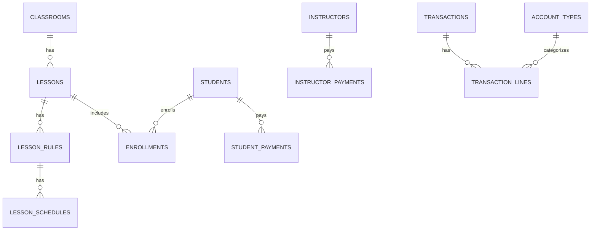

# DB 구조 요약 (비개발자용)

레거시를 제외하고, 현재 실제로 사용되는 테이블만 한 눈에 보이도록 정리했습니다.

## 1) 데이터베이스 파일 위치
- 앱 실행 시 `app.getPath('userData')` 아래에 `lms2.sqlite` 파일이 생성됩니다.
- 운영체제에 따라 실제 폴더 위치는 달라집니다.

## 2) 테이블 한눈에 (현재 사용 구조)
| 구분 | 테이블 | 한 줄 설명 |
| --- | --- | --- |
| 기본 | classrooms | 교실 배치(위치/크기/색/이름) |
| 기본 | lessons | 수업 기본 정보(요일/시간/교실/강사/과정 등) |
| 기본 | meta | 내부 설정값 저장 |
| 인원 | instructors | 강사 정보 |
| 인원 | students | 학생 정보 + 보호자/결제 관련 |
| 과정 | courses | 과목/과정 정보 |
| 과정 | enrollments | 학생-수업 연결(수강 등록) |
| 일정 | lesson_rules | 정규 수업 반복 규칙(요일/시간/기간) |
| 일정 | lesson_schedules | 날짜별 실제 수업 일정(정규/비정규 모두) |
| 설정 | settings | 앱 설정값 |
| 회계 | account_types | 계정 과목(회계 분류) |
| 회계 | transactions | 거래(1건) |
| 회계 | transaction_lines | 거래 상세(차변/대변) |
| 회계 | student_payments | 학생 수납 |
| 회계 | instructor_payments | 강사 급여 |
| 회계 | expenses | 기타 지출 |
| 회계 | other_income | 기타 수입 |

## 3) 테이블 상세 (필요한 정보만 요약)
### classrooms
- **무엇**: 교실(강의실) 배치 정보
- **주요 항목**: 위치(x, y), 크기(width, height), 색상(color), 이름(name)

### lessons
- **무엇**: 수업/강의 기본 정보
- **주요 항목**:
  - 교실(classroom_id)
  - 수업명(title), 담당강사 텍스트(instructor)
  - 담당강사 연결(instructor_id), 과정 연결(course_id)
  - 상태(status)
  - 비고(note), 생성/수정 시간(created_at, updated_at)
- **관계**: `classroom_id`는 classrooms.id와 연결

### lesson_rules (정규 수업 규칙)
- **무엇**: 매주 반복되는 정규 수업 규칙
- **주요 항목**:
  - 수업(lesson_id), 요일(day), 시작/끝 슬롯(start_slot, end_slot)
  - 시작/종료 날짜(start_date, end_date), 반복 주기(interval_weeks)
  - 활성(active), 생성/수정 시간(created_at, updated_at)
- **관계**: lessons.id와 연결

### meta
- **무엇**: 내부 설정값 저장
- **주요 항목**: key, value
- **예시 키**: `auto_migrate`, `schema_version`

### instructors (강사)
- **무엇**: 강사 정보
- **주요 항목**: 이름(first_name/last_name), 이메일, 전화번호, 시급, 자격, 입사일, 상태, 메모
- **상태 값**: active, inactive, on_leave
- **비고**: 이름 병합 마이그레이션으로 실제로는 `first_name`에 전체 이름이 들어가고 `last_name`은 비어있는 경우가 많습니다.

### students (학생)
- **무엇**: 학생 정보
- **주요 항목**: 이름, 연락처, 생년월일, 등록일, 상태, 보호자 정보, 결제 정보, 주소/메모
- **상태 값**: active, inactive, graduated, dropped
- **추가 정보**: 학교급(school_type), 학년(grade)

### courses (과정)
- **무엇**: 과목/과정 정보
- **주요 항목**: 코드(code), 이름(title), 설명, 학점/정원/수강료, 상태
- **상태 값**: active, inactive, archived

### settings (설정)
- **무엇**: 앱 설정값
- **대표 키**:
  - `use_course_system`: 과정 시스템 사용 여부
  - `school_name`: 학원 이름

### enrollments (수강 등록)
- **무엇**: 학생이 어떤 수업을 수강하는지
- **주요 항목**: student_id, lesson_id, 등록일, 상태, 성적
- **상태 값**: enrolled, completed, dropped, pending
- **관계**: students.id, lessons.id와 연결

### lesson_schedules (수업 일정)
- **무엇**: 날짜별 실제 수업 일정 (정규/비정규 모두의 원본 데이터)
- **주요 항목**: lesson_id, 날짜, 시작/종료 시간, 진행 상태
- **상태 값**: scheduled, completed, cancelled, makeup
- **관계**: lessons.id와 연결, rule_id는 정규 수업 규칙과 연결(정규 수업인 경우)

### 회계(수입/지출) 관련
#### account_types (계정 과목)
- **무엇**: 회계 분류(예: 수강료, 급여 등)
- **주요 항목**: 코드, 이름, 카테고리(revenue/expense/asset/liability/equity)

#### transactions (거래)
- **무엇**: 하나의 거래 기록(예: 수강료 입금 1건)
- **주요 항목**: 거래일, 설명, 참조 타입/ID, 총액, 상태
- **상태 값**: pending, completed, cancelled

#### transaction_lines (거래 상세)
- **무엇**: 거래의 차변/대변 분해 내역
- **주요 항목**: transaction_id, account_type_id, entry_type, 금액
- **entry_type 값**: debit, credit

#### student_payments (학생 결제)
- **무엇**: 학생별 수납 기록
- **주요 항목**: student_id, 결제일, 금액, 결제수단, 예상일, 상태
- **결제수단 값**: cash, card, bank_transfer, check, zeropay, other
- **상태 값**: completed, pending, overdue, failed, cancelled

#### instructor_payments (강사 급여)
- **무엇**: 강사 급여 지급 기록
- **주요 항목**: instructor_id, 지급일, 금액, 근무시간, 급여기간, 상태
- **상태 값**: pending, completed, cancelled

#### expenses (기타 지출)
- **무엇**: 강사 급여 외 지출
- **주요 항목**: 지출일, 카테고리, 금액, 결제수단, 수령인, 메모
- **카테고리 값**: labor, rent, utilities, supplies, marketing, tax, insurance, maintenance, other

#### other_income (기타 수입)
- **무엇**: 수강료 외 수입
- **주요 항목**: 수입일, 카테고리, 금액, 결제수단, 수입자, 메모
- **카테고리 값**: material_sales, facility_rental, consulting, subsidy, interest, other

## 4) 관계 한눈에 (요약)
- **classrooms 1:N lessons**
- **lessons 1:N lesson_rules**
- **lesson_rules 1:N lesson_schedules** (정규 수업)
- **lessons 1:N lesson_schedules** (수업 세션 원본)
- **students N:M lessons** (중간 테이블: enrollments)
- **students 1:N student_payments**
- **instructors 1:N instructor_payments**
- **transactions 1:N transaction_lines**
- **account_types 1:N transaction_lines**

## 5) 간단한 다이어그램 (Mermaid ERD)

