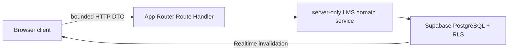

# NEXTUM LMS

NEXTUM LMS is the operator-facing web application for academy administration. It is a
Next.js App Router application backed by Supabase Auth and PostgreSQL. This repository
owns the shared database contract; Grade App consumes the approved identity, content,
learning, and Realtime contracts without owning independent DDL.

## Runtime architecture

Protected pages are server-first:

1. The `(app)` server layout validates the Supabase session.
2. `src/lib/lms/shell-context.ts` loads the active account, academy membership,
   person/staff references, and academy name once per request.
3. The layout passes a minimal serializable profile to `AppShell`.
4. Client feature screens call bounded `/api/lms/*` Route Handlers.
5. Route Handlers authorize the request and delegate to server-only domain code under
   `src/lib/lms`.

Browser-side Supabase usage is limited to the authentication lifecycle and Realtime
invalidation. Business reads and writes do not use a secret key in the browser and do
not query identity tables during hydration.



See [the architecture document](docs/architecture.md) for the full runtime, API, cache,
and cross-app ownership contract.

## Stack

- Next.js 16 App Router and React 19
- TypeScript and Tailwind CSS
- Supabase Auth, PostgreSQL, RLS, and Realtime
- Radix UI and shared NEXTUM UI primitives
- Vitest, React Testing Library, Playwright, ESLint, and Knip

Node.js 24 is the CI baseline. When using the Supabase CLI through `npx`, a local
Docker-compatible container runtime is also required.

## Local setup

```powershell
npm ci
Copy-Item .env.example .env.local
npm run dev
```

Open the URL printed by Next.js. The minimum application environment is:

```dotenv
NEXT_PUBLIC_SUPABASE_URL=
NEXT_PUBLIC_SUPABASE_PUBLISHABLE_KEY=
SUPABASE_SECRET_KEY=
NEXT_PUBLIC_LMS_LOGIN_EMAIL_DOMAIN=nextum.local
```

`SUPABASE_SECRET_KEY` may be replaced by the legacy
`SUPABASE_SERVICE_ROLE_KEY` fallback. Both are server-only and must never use a
`NEXT_PUBLIC_` prefix. Optional server-side secrets include
`LMS_ADMIN_CONFIRM_SECRET`, `LMS_REAUTH_SECRET`, and
`NEXTUM_INVITE_CODE_SECRET`; each falls back to the configured server-only Supabase
secret where supported.

To run against the local Supabase stack:

```powershell
npx supabase start
npx supabase db reset
npm run db:check
```

Use the URL and publishable/secret values printed by `supabase start` in
`.env.local`. Do not commit `.env.local`. A fresh reset currently stops in the
historical `20260706102000_learning_canonical_assignments.sql` migration before the
v2 migration is reached; do not edit that applied file. Follow the forward-only
history reconciliation blocker and commands in the v2 runbook before treating a
fresh local reset as a passing gate.

## Development admin

The `admin / 1234` account is development-only and is not created by production
migrations.

```powershell
$env:LMS_DEV_SEED_ALLOW = "true"
npm run seed:dev-admin
```

The seed script requires `SUPABASE_SECRET_KEY` or
`SUPABASE_SERVICE_ROLE_KEY` and refuses to run unless
`LMS_DEV_SEED_ALLOW=true` is set in the current shell.

## Page routes

All routes except `/login` are protected by the `(app)` server layout.

| Route | Purpose |
| --- | --- |
| `/login` | Supabase Auth login |
| `/` | Learning and academy operations dashboard |
| `/assignments` | Assignment list, filters, deployment, and management |
| `/assignments/new` | Content-scope or worksheet assignment creation |
| `/assignments/[assignmentId]` | Assignment recipients, progress, and problem detail |
| `/classrooms` | Class roster and operations overview |
| `/classrooms/attendance` | Attendance recording |
| `/classrooms/schedule` | Recurring schedule and occurrence management |
| `/classrooms/settings` | Class, classroom, and book settings |
| `/students` | Student roster and lifecycle management |
| `/students/[studentId]` | Student profile, learning metrics, and AI conversations |
| `/instructors` | Staff/instructor roster and lifecycle management |
| `/instructors/[staffId]` | Staff profile and assignment detail |
| `/accounting` | Billing, payments, expenses, and payroll |
| `/settings` | Tax defaults, export, and guarded reset operations |

Public account creation is not exposed by this application. LMS can issue a student
invitation from the student-management flow, but invitation acceptance and Grade App
account creation are a separate consumer contract.

## API routes

Route Handlers live under `src/app/api/lms`. The current application server surface is:

| Domain | Routes |
| --- | --- |
| Shell/read models | `GET /api/lms/academy`, `GET /api/lms/dashboard`, `GET /api/lms/accounting` |
| Assignments | `GET/POST /api/lms/assignments`, `GET /api/lms/assignments/catalog`, `GET /api/lms/assignments/detail`, `POST /api/lms/assignments/import`, `POST /api/lms/assignments/recall`, `POST /api/lms/assignments/delete`, `POST /api/lms/assignments/recipients` |
| Classes | `POST /api/lms/classes`, `GET /api/lms/classes/overview`, `GET /api/lms/classes/detail`, `POST /api/lms/classrooms`, `POST /api/lms/books`, `POST /api/lms/class-books`, `POST /api/lms/schedule-rules`, `POST /api/lms/lesson-occurrences`, `POST /api/lms/attendance` |
| Students | `GET/POST /api/lms/students`, `GET /api/lms/students/detail`, `GET /api/lms/students/learning-metrics`, `GET /api/lms/students/ai-conversations`, `POST /api/lms/students/invitations`, `POST /api/lms/students/archive`, `POST /api/lms/students/hard-delete-preview`, `POST /api/lms/students/hard-delete` |
| Staff | `GET/POST /api/lms/staff`, `GET /api/lms/staff/overview`, `GET /api/lms/staff/detail`, `POST /api/lms/staff/archive`, `POST /api/lms/staff/hard-delete-preview`, `POST /api/lms/staff/hard-delete` |
| Finance | `POST /api/lms/billing/generate`, `POST /api/lms/payments`, `POST /api/lms/expenses`, `POST /api/lms/payroll` |
| Admin | `POST /api/lms/admin/reauth`, `POST /api/lms/admin/export`, `POST /api/lms/admin/reset`, `POST /api/lms/admin/reset/confirm`, `POST /api/lms/admin/tax-settings` |

The API is excluded from the page-session proxy. Every Route Handler owns its request
authentication, academy/role authorization, validation, and same-origin/CSRF checks
where applicable.

## Database and migration ownership

`supabase/migrations/` is the authoritative, ordered database history. The
`0001_nextum_lms_baseline.sql` file is the foundation for a clean database; every
later timestamped migration is forward-only and remains part of the contract.

- This LMS repository is the single DDL and migration owner.
- Grade App must not apply independent shared-schema DDL or replace
  `supabase/config.toml` exposure settings.
- Never edit an already-applied migration. Create a new file with
  `npx supabase migration new <description>`.
- Validate locally with `npx supabase db reset`, `npm run db:check`, and
  `npx supabase migration list --local`.
- Coordinate remote `db push` so one migration owner deploys at a time.
- Never apply the baseline destructively to an existing project. Follow the backup,
  rollout, verification, and rollback gates in the runbook.

Current database references:

- [Canonical schema summary](DATABASE_SCHEMA.md)
- [Architecture and ownership](docs/architecture.md)
- [Supabase optimization v2 runbook](docs/supabase-optimization-v2-runbook.md)
- [Grade App optimization impact](docs/grade-app-optimization-impact.md)
- [Assignment distribution workflow](docs/assignment-distribution-workflow.md)
- [Existing nextum-data cutover context](docs/nextum-data-cutover-runbook.md)

Useful read-only/backup commands:

```powershell
npm run db:check
npm run db:backup-content -- --dry-run
npm run db:backup-preservation -- --dry-run
npm run db:import-grade-fixtures
```

Backups are written under the git-ignored `backups/` directory. Review the runbook
before removing any Grade App compatibility table, column, view, policy, or wrapper.

## Verification

The required local and CI gate is:

```powershell
npm run verify
```

It runs ESLint and the UI-system guard, TypeScript, coverage thresholds, Knip
dead-code/dependency checks, the production Next.js build, and the client bundle
budget check. Useful focused commands:

```powershell
npm run lint
npm run typecheck
npm run test:run
npm run test:coverage
npm run deadcode
npm run build
npm run bundle:check
npm run test:e2e
npm run db:check
npm run smoke:lms
```

`bundle:check` and `test:e2e` consume the production `.next` output, so run
`npm run build` first when invoking either outside `npm run verify`. The GitHub Actions workflow in
`.github/workflows/quality.yml` runs `npm ci`, `npm run verify`, installs Playwright
Chromium with system dependencies through
`npx playwright install --with-deps chromium`, and then runs `npm run test:e2e` for
pull requests and pushes to `main`.

## UI system

Read [docs/lms-ui-system.md](docs/lms-ui-system.md) before changing LMS UI. New
screens should use shared primitives from `src/components/ui` and pass:

```powershell
npm run ui:check
```
