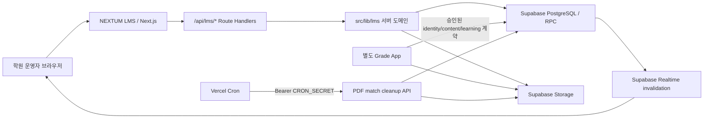
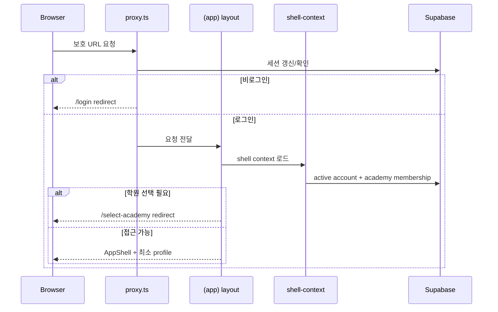
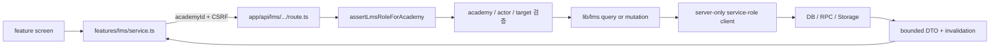

# NEXTUM LMS 프로젝트 종합 인수인계 가이드

> 감사 기준일: 2026-07-20 KST  
> 기준 브랜치/커밋: `main` / `f3dcc0e` (`다중 학원 선택과 통합 관리자 권한 추가`)  
> 감사 범위: 애플리케이션, Route Handler, 인증·권한, Supabase 원격 카탈로그, migration, Storage, 스크립트, 테스트, CI, Vercel 설정, 기존 문서  
> 문서 목적: 이 프로젝트를 처음 접한 개발자도 구조를 파악하고, 안전하게 수정·검증·배포 준비를 할 수 있게 하는 단일 진입점

이 문서는 2026-07-20의 코드와 연결된 `nextum-data` Supabase 프로젝트를 직접 교차 검증한 결과다. 정적인 설계 설명과 변할 수 있는 운영 스냅샷을 구분해서 기록한다.

- **코드 사실**: 저장소의 현재 코드·설정에서 확인한 내용
- **운영 스냅샷**: 감사 시점 원격 Supabase에서 확인한 값. 데이터 건수와 Advisor 결과는 이후 달라질 수 있다.
- **정적 추론**: 코드를 따라가며 발견했지만 실제 운영 시나리오를 끝까지 실행하지 않은 내용
- **작업 트리 초안**: 아직 Git에 추적되지 않아 제품 계약으로 확정할 수 없는 문서

---

## 1. 가장 먼저 알아야 할 것

NEXTUM LMS는 학원 운영자를 위한 한국어 웹 애플리케이션이다. 반·학생·강사·시간표·출결·과제·학습 분석·회계를 관리한다. 별도의 Grade App이 같은 Supabase의 승인된 identity/content/learning 계약을 소비하지만, 공유 DB의 DDL과 migration 소유자는 이 저장소 하나다.

현재 구조를 한 문장으로 요약하면 다음과 같다.

> Next.js App Router 화면이 `/api/lms/*` Route Handler를 호출하고, 서버 전용 LMS 도메인 코드가 academy 범위를 검증한 뒤 service-role Supabase client로 PostgreSQL·RPC·Storage에 접근한다.

### 1.1 신규 작업자가 바로 확인할 현재 상태

| 항목 | 2026-07-20 상태 |
| --- | --- |
| 앱 형태 | 단일 Next.js App Router 앱. 모노레포·workspace 아님 |
| 기준 런타임 | Node.js 24, Next.js 16.2.10, React 19.2.4, TypeScript 5.9.3 |
| 규모 | `rg --files` 기준 409개, `src` 312개 |
| 화면 | `page.tsx` 29개 |
| 서버 API | Route Handler 파일 61개 |
| 테스트 | Vitest 파일 81개, 402개 테스트 |
| DB 이력 | migration 46개, 로컬/원격 이력 일치 |
| 원격 DB | 81개 테이블, 전부 RLS 활성화 |
| 원격 Storage | private bucket 2개 |
| 품질 게이트 | `npm run verify`가 **bundle budget 1건 때문에 실패** |
| 실패 원인 | `/assignments/pdf-match` client bundle 191.7 KiB, 예산 187 KiB보다 4.7 KiB 큼 |
| 별도 확인 | Playwright 1/1 통과, `npm run db:check` 48/48 통과 |

### 1.2 지금 작업하기 전에 읽을 순서

1. 이 문서
2. 저장소 상시 규칙인 [`.agent/rules/dev-guide.md`](../.agent/rules/dev-guide.md)
3. [CONTEXT.md](../CONTEXT.md)
4. [README.md](../README.md)
5. [아키텍처 문서](architecture.md)
6. DB 작업이면 [DATABASE_SCHEMA.md](../DATABASE_SCHEMA.md)와 실제 [migration 디렉터리](../supabase/migrations)
7. UI 작업이면 [LMS UI 시스템](lms-ui-system.md)
8. 변경하려는 도메인의 화면 → browser service → Route Handler → `src/lib/lms` → migration/RPC 순서

상시 규칙의 요지는 다음과 같다.

- 코드 수정 전에 `CONTEXT.md`를 읽는다.
- 큰 변경은 코드와 문서를 같은 작업에서 갱신한다.
- UI는 `src/components/ui`의 공용 primitive를 먼저 사용하고 `npm run ui:check`를 통과시킨다.
- 외부 입력을 신뢰하지 않고, 비밀을 하드코딩하지 않는다.
- 적용된 migration은 수정하지 않고 새 forward-only migration을 만든다.

### 1.3 현재 작업 트리 주의

감사 시작 시 아래 사용자 변경이 이미 존재했다. 이 문서를 작업하면서 되돌리거나 수정하지 않았다.

```text
 M next-env.d.ts
?? docs/ai-handoff-assignment-policy.md
?? docs/학습-증거-기반-학생-지원-시스템-기획서.md
```

두 문서는 제품 방향을 이해하는 데 유용하지만 아직 Git에 추적되지 않은 **작업 트리 초안**이다. 구현 완료 사실이나 확정 계약으로 인용하지 말고, 채택할 경우 명시적으로 함께 커밋한다.

---

## 2. 감사에서 확인한 핵심 결론

### 2.1 잘 되어 있는 부분

- 페이지 요청과 API 요청의 인증 경계가 분리되어 있고, API가 proxy에 기대지 않고 핸들러별 인증을 수행한다.
- mutation은 Origin 확인과 double-submit CSRF를 적용한다.
- 현재 academy를 서버에서 다시 검증하며, 교사·강사의 반 범위도 서버 권한 모델에 포함한다.
- private helper schema, `security_invoker` view, service-role 전용 import table 등 Supabase 권한 설계가 비교적 명시적이다.
- 핵심 과제 생성·학습 제출은 DB RPC를 통해 원자성을 강화했다.
- 브라우저 데이터 계층에 TTL cache, in-flight dedupe, Realtime invalidation, 탭 간 invalidation 전파가 있다.
- 단위·계약 테스트 범위가 넓고, lint·UI 규칙·typecheck·coverage·Knip·build·bundle budget을 한 게이트로 묶었다.
- PDF/OCR 처리는 외부 OCR HTTP 서비스가 아니라 로컬 정적 자산과 브라우저 실행을 사용한다.

### 2.2 바로 인지해야 할 위험

1. **현재 `npm run verify`는 통과하지 않는다.** 코드·테스트·build가 아니라 PDF 매칭 화면의 client bundle이 예산을 4.7 KiB 초과한 것이 원인이다.
2. **과거 migration 수치를 현재 값으로 읽으면 안 된다.** 실제·원격 이력은 46개다. 이 문서 작업에서 README는 46개로 정정했지만 v2 runbook의 30개는 당시 rollout 기록으로 남아 있다.
3. **최신 migration에 특정 운영 tenant 데이터가 섞여 있다.** 학원명 변경, 특정 `admin@nextum.local` 계정의 super-admin 부여, 신규 학원 자동 membership trigger를 포함한다.
4. **CI는 DB 계약을 검증하지 않는다.** 로컬 Supabase reset, RLS 역할 행렬, SQL smoke 4개, `db:check`가 GitHub Actions에 없다.
5. **service-role 의존도가 높다.** RLS만 믿을 수 없고 모든 Route Handler와 도메인 함수가 academy·actor·target scope를 계속 검증해야 한다.
6. **생성된 Supabase Database 타입이 없다.** schema/RPC drift가 컴파일보다 런타임 PostgREST 오류로 드러날 수 있다.
7. **`.env.example`이 실제 변수 전부를 설명하지 않는다.**
8. **회계 메뉴와 학습 진입점의 발견성이 낮다.** 회계는 Sidebar에서 강제로 제거되고 학습은 독립 메뉴가 없다. 직접 URL은 존재한다.
9. **구조화된 애플리케이션 관측 도구가 없다.** Sentry/OpenTelemetry 없이 console과 Vercel/Supabase 플랫폼 로그에 의존한다.

우선순위와 대응안은 [17. 위험·기술부채 등록부](#17-위험기술부채-등록부)에 정리했다.

---

## 3. 제품 범위와 시스템 경계

### 3.1 이 앱이 담당하는 것

- 운영자 로그인과 학원 선택
- 대시보드
- 반·강의실·교재·강사 배정
- 반복 시간표, 수업 occurrence, 출결
- 학생·직원 생명주기 관리
- 문제은행 기반 과제 생성, 수신자 배포, 회수·삭제
- worksheet import
- PDF 문제 코드 추출·매칭·개별/일괄 배정
- 학습 증거 조회와 분석 계획
- 수납·급여·지출·세금 설정·CSV export
- 학생 초대 발급
- 관리자 재인증과 보호된 초기화

### 3.2 이 앱이 담당하지 않는 것

- 학생·보호자용 운영 UI
- 공개 회원가입
- Grade App의 학습·채점 UI
- 별도 OCR SaaS
- Supabase Edge Function
- 독립적인 background worker
- Grade App이 소유하는 별도 공유-schema DDL

### 3.3 외부 시스템과 계약



- **Supabase**: Auth, PostgreSQL, PostgREST/RPC, RLS, Realtime, Storage
- **Vercel**: Next.js 배포와 cron
- **Grade App**: 같은 DB 계약의 소비자. 이 저장소가 공유 schema의 migration owner다.
- **StudyQ 자료**: 런타임 통합이 아니라 import 시점 데이터·자산의 원천이다.

---

## 4. 기술 스택과 저장소 구조

### 4.1 실제 설치 버전

2026-07-20 `npm ls --depth=0`과 lockfile 기준이다.

| 범주 | 기술 | 실제 설치 |
| --- | --- | --- |
| Runtime | Node.js | 24.13.1 로컬, CI major 24 |
| Package manager | npm | 11.6.4 로컬 |
| Web | Next.js | 16.2.10 |
| UI runtime | React / React DOM | 19.2.4 |
| Language | TypeScript | 5.9.3, strict |
| Styling | Tailwind CSS | 3.4.19 |
| Backend client | `@supabase/supabase-js` | 2.110.0 |
| SSR auth | `@supabase/ssr` | 0.12.0 |
| Unit/component test | Vitest | 4.1.10 |
| Browser test | Playwright | 1.61.1 |
| UI primitives | Radix UI, CVA, lucide-react | package.json 참조 |
| PDF/OCR | pdfjs-dist, Tesseract.js, canvas, TUS | package.json 참조 |

`package.json`에 `engines`, `packageManager`, `.nvmrc`가 없어 Node 24가 로컬에서 강제되지는 않는다. CI와 README를 기준으로 Node 24를 사용한다.

### 4.2 디렉터리 지도

```text
nextum-lms/
├─ src/
│  ├─ app/                 # App Router page/layout/loading/error + API Route Handler
│  ├─ app-routes/          # URL page가 연결하는 얇은 route component
│  ├─ components/
│  │  ├─ layout/           # AppShell, Sidebar
│  │  ├─ security/         # 접근 거부 등
│  │  └─ ui/               # 공용 Button, Dialog, Table, Select, PageShell 등
│  ├─ core/                # 역할, Supabase browser client 등 기반 코드
│  ├─ contexts/            # 인증 context
│  ├─ features/lms/        # 큰 운영 화면, browser API service, 화면 DTO/type
│  ├─ lib/lms/             # 서버 도메인, 인증, query/mutation, PDF, 분석
│  ├─ lib/supabase/        # browser/server/admin client와 proxy
│  └─ screens/             # LoginPage 등
├─ supabase/
│  ├─ migrations/          # 공유 DB의 유일한 순서 있는 DDL 이력
│  ├─ tests/               # SQL smoke test 4개
│  └─ config.toml          # local stack/Data API schema exposure
├─ scripts/                # 품질 검사, DB health, backup/import/seed/smoke
├─ e2e/                    # Playwright 로그인 smoke 1개
├─ public/                 # postinstall로 PDF.js/Tesseract 자산 생성
├─ docs/                   # 설계·운영·워크플로 문서
├─ .github/workflows/      # quality CI
├─ vercel.json             # framework + cleanup cron
└─ package.json
```

### 4.3 의도적으로 없는 것

- monorepo/workspace 설정
- Redux, Zustand, React Query
- react-hook-form, Zod
- Next.js Server Actions (`"use server"`)
- Supabase generated `Database` 타입
- Supabase Edge Function
- Dockerfile 또는 저장소 내부 배포 workflow
- i18n framework
- Sentry/OpenTelemetry 같은 구조화된 애플리케이션 관측 SDK

### 4.4 큰 파일과 변경 난이도

다음 파일은 책임이 집중되어 있어 작은 수정도 영향 범위를 넓게 잡아야 한다. 줄 수는 감사 시점 근사치다.

| 파일 | 약 줄 수 | 역할 |
| --- | ---: | --- |
| `src/lib/lms/mutations.ts` | 3,135 | 여러 LMS mutation |
| `src/features/lms/assignments-operations-page.tsx` | 3,084 | 과제 생성·운영 UI |
| `src/features/lms/pages.tsx` | 1,922 | 대시보드·회계·설정 등 |
| `src/lib/lms/student-queries.ts` | 1,895 | 학생 read model |
| `src/lib/lms/class-queries.ts` | 1,795 | 반 read model |
| `src/features/lms/classrooms-operations-page.tsx` | 1,637 | 반 운영 UI |
| `src/features/lms/students-operations-page.tsx` | 1,579 | 학생 운영 UI |
| `src/features/lms/types.ts` | 1,336 | browser DTO/type |
| `src/features/lms/service.ts` | 1,302 | browser API/cache/realtime |
| `src/features/lms/learning-analysis-view.tsx` | 1,293 | 학습 분석 UI |

새 기능을 추가할 때 이 파일에 상태와 UI를 계속 누적하기보다 dialog/view/hook/도메인 모듈을 책임 단위로 분리하는 것이 안전하다. 단, 새로운 전역 상태 라이브러리를 바로 도입하기보다 기존 패턴 안에서 먼저 분리한다.

---

## 5. 런타임 요청 흐름

### 5.1 보호 페이지



핵심 파일:

- [페이지 proxy](../src/proxy.ts)
- [Supabase session proxy](../src/lib/supabase/proxy.ts)
- [보호 layout](../src/app/(app)/layout.tsx)
- [shell context](../src/lib/lms/shell-context.ts)
- [AppShell](../src/components/layout/AppShell.tsx)
- [역할 정의](../src/core/auth/roles.ts)

### 5.2 API 요청

`src/proxy.ts`의 matcher는 `/api`를 제외한다. 따라서 브라우저 페이지가 로그인되어 보인다는 사실은 API 인증 근거가 아니다.



API 변경 시 반드시 확인할 순서:

1. session/account가 active인지
2. 요청 academy에 membership과 요구 role이 있는지
3. teacher/instructor라면 대상 반이 배정 범위인지
4. URL/body의 학생·반·과제·직원 FK가 같은 academy에 속하는지
5. mutation이면 same-origin/CSRF가 적용되는지
6. 내부 DB/storage 오류가 public response에 그대로 노출되지 않는지
7. mutation 이후 필요한 cache invalidation domain이 반환되는지

### 5.3 표준 mutation 응답

[api-response.ts](../src/lib/lms/api-response.ts)의 기본 계약:

```ts
// 성공
{
  success: true,
  data: unknown,
  invalidation?: {
    // academy/domain/entity 범위
  }
}

// 실패
{
  success: false,
  error: {
    code: string,
    message: string,
    requestId: string,
    fieldErrors?: Record<string, string[]>
  }
}
```

- `Cache-Control: no-store`
- `X-Request-Id` 응답 헤더
- caller가 보낸 유효한 `x-request-id`를 이어 쓰거나 UUID 생성
- 내부 예외 내용은 로그에만 남기고 안정된 public message를 반환

감사 시점 60개 LMS Route Handler 중 38개가 표준 mutation helper를 사용한다. 나머지는 주로 read handler나 직접 응답 경로라 응답 모양이 완전히 단일화되지는 않았다. 기존 endpoint를 바꿀 때 browser service의 파싱 계약을 함께 확인한다.

---

## 6. 인증, 학원 선택, 역할과 보안

### 6.1 로그인과 계정 확인

- 사용자가 입력한 로그인 ID를 설정된 도메인의 이메일로 바꿔 Supabase password login을 수행한다.
- 서버는 `auth.getClaims()` 뒤 `core.user_accounts`의 active 상태를 확인한다.
- public 회원가입은 없다.
- 정확히 `loginId === "admin"`인 로그인만 즉시 `/select-academy`로 이동하는 특수 분기가 있다. 다른 다중 학원 사용자는 보호 layout의 일반 redirect에 의존한다.

주요 파일:

- [LoginPage](../src/screens/LoginPage.tsx)
- [academy access](../src/lib/lms/academy-access.ts)
- [auth helpers](../src/lib/lms/auth.ts)

### 6.2 학원 컨텍스트

선택된 학원은 `nextum_lms_academy` cookie에 저장된다.

- HTTP-only
- SameSite `strict`
- production에서 secure
- path `/`
- max age 12시간

학원 선택 API는 cookie 값을 그대로 신뢰하지 않고 현재 계정이 접근 가능한 학원인지 확인한다. `super_admin` 여부는 browser `user_metadata`가 아니라 `core.user_accounts.metadata`에서 서버가 읽는다.

관련 파일:

- [academy cookie](../src/lib/lms/academy-cookie.ts)
- [academy selection](../src/lib/lms/academy-selection.ts)
- [academy selection API](../src/app/api/lms/academy-selection/route.ts)

### 6.3 역할별 페이지 범위

| 역할 | 일반 운영 | 회계 | 설정 | 반 범위 |
| --- | --- | --- | --- | --- |
| `owner` | 가능 | 가능 | 가능 | 전체 |
| `admin` | 가능 | 가능 | 가능 | 전체 |
| `staff` | 가능 | 가능 | 불가 | 역할/서버 권한 기준 |
| `teacher` | 가능 | 불가 | 불가 | 배정 반 |
| `instructor` | 가능 | 불가 | 불가 | 배정 반 |
| `student` | 운영 UI 없음 | 불가 | 불가 | Grade App 대상 |
| `guardian` | 운영 UI 없음 | 불가 | 불가 | Grade App 대상 |

정확한 path 매핑은 [roles.ts](../src/core/auth/roles.ts)가 기준이다. UI 메뉴 숨김은 편의 기능일 뿐 보안 경계가 아니며 Route Handler와 DB scope가 최종 기준이다.

### 6.4 CSRF와 민감 관리자 작업

- mutation은 Origin과 double-submit CSRF cookie/header를 함께 확인한다.
- 관리자 재인증은 비밀번호 확인 후 user/academy 범위의 5분 HTTP-only token을 발급한다.
- 데이터 reset은 재인증 외에 action/target에 묶인 60초 HMAC confirm token이 필요하다.
- confirm token은 nonce를 저장·소진하지 않으므로 TTL 안 재사용이 가능하다. 다른 권한·CSRF·재인증 장치가 있어 즉시 취약점으로 단정하지는 않지만 one-time 보장을 원하면 개선해야 한다.
- 전용 `LMS_REAUTH_SECRET`, `LMS_ADMIN_CONFIRM_SECRET`, invite secret을 설정하지 않으면 일부 경로가 Supabase server secret으로 fallback한다. 운영에서는 목적별 별도 secret을 권장한다.

### 6.5 보안 헤더

[next.config.ts](../next.config.ts)는 다음을 설정한다.

- 제한된 CSP: `base-uri`, `frame-ancestors`, `object-src`
- HSTS
- `X-Content-Type-Options`
- `X-Frame-Options`
- Referrer Policy
- Permissions Policy
- `poweredByHeader: false`

현재 CSP는 script/style/connect source까지 포괄하는 완전한 allowlist가 아니다. 강화할 때 Supabase Realtime, PDF worker, Tesseract worker/wasm, Next.js 런타임을 실기기에서 함께 검증한다.

---

## 7. 페이지와 사용자 워크플로

### 7.1 핵심 화면

| 경로 | 역할 |
| --- | --- |
| `/login` | Supabase Auth 로그인 |
| `/select-academy` | 다중 학원 계정의 현재 학원 선택 |
| `/` | 운영 대시보드 |
| `/assignments` | 배포 과제 현황·상세 |
| `/assignments/new` | 문제은행/worksheet 기반 과제 생성 |
| `/assignments/[assignmentId]` | 특정 과제 상세를 초기 선택 |
| `/assignments/pdf-match` | PDF 분석·코드 매칭·개별/일괄 배정 |
| `/classrooms` | 반 디렉터리 |
| `/classrooms/schedule` | 전체 시간표 |
| `/classrooms/attendance` | 전체 출결 |
| `/classrooms/settings` | 공용 강의실·교재·반 설정 |
| `/classrooms/[classId]/*` | 반별 개요·시간표·학생·학습·교재·설정 |
| `/students`, `/students/[studentId]` | 학생 목록·상세 |
| `/instructors`, `/instructors/[staffId]` | 직원/강사 목록·상세 |
| `/accounting/*` | 수납·급여·지출·보고서 |
| `/settings` | 세금, CSV export, 보호된 reset |

전체 29개 page route는 [부록 A](#부록-a-전체-page-route)에 있다.

### 7.2 대표 작업 흐름

#### 반 운영

1. `/classrooms`에서 반 검색·필터
2. 반 상세 진입
3. 개요, 시간표, 학생, 학습, 교재, 설정 탭 사용
4. teacher/instructor는 서버가 반환한 `operatorClassIds`와 occurrence 권한 안에서만 조작
5. 출결 미저장 상태에서 다른 수업으로 이동하면 이탈 경고

#### 일반 과제

1. `/assignments/new`
2. 교재·학년·단원·유형 또는 worksheet 범위 선택
3. 문제와 수신자 선택
4. 기본 경로는 `learning.create_assignment_v2` RPC로 assignment/target/recipient/item 생성
5. `/assignments`에서 진행률·수신자·문항 상세 확인
6. 권한에 따라 수신자 조정, 회수, 삭제

#### 학습 분석에서 과제 연결

1. 반 학습 화면에서 증거·취약 유형·계획 확인
2. 조치 대상 문제를 과제 초안으로 전환
3. 초안은 `sessionStorage`에 최대 24시간, 최대 200개 보관
4. `/assignments/new`에서 초안을 읽어 과제 생성

브라우저·탭·만료를 넘는 서버 영속 draft가 아니므로 장기 작업 UX로 간주하면 안 된다.

#### PDF 문제 매칭

1. 학생과 PDF 선택
2. PDF.js 텍스트 추출
3. 텍스트가 없는 페이지만 Tesseract OCR
4. 7자리 문제 코드 추출·검토
5. signed TUS upload
6. 서버가 signature, hash, fingerprint, 크기, 페이지 수, 답안/해설 특징 확인
7. batch/job/item 모델로 매칭
8. 개별 또는 batch finalize로 과제 배정

기본 제한은 PDF 50 MB, 200페이지다. OCR은 브라우저 CPU·메모리를 사용하므로 저사양 기기와 큰 스캔 파일을 실기기에서 검증해야 한다.

### 7.3 발견성 주의

- Sidebar가 회계 항목을 정의한 뒤 `.filter(item => item.id !== "accounting")`로 항상 제거한다. 직접 URL과 role access는 살아 있다. 의도적 비노출인지 제품 결정을 확인한다.
- `/learning`과 `/learning/exams`는 독립 화면이 아니라 class learning 경로로 redirect한다.
- PDF 메뉴는 `PDF_ASSIGNMENT_MATCH_ENABLED === "false"`일 때만 숨는다. 변수가 없으면 기본 활성이다.

---

## 8. 프런트엔드 구조

### 8.1 렌더링과 shell

보호 layout이 서버에서 session과 shell context를 만든 뒤 최소 직렬화 profile을 `AppShell`에 전달한다.

```text
(app)/layout.tsx
  └─ AppShell
      ├─ AuthProvider
      ├─ Sidebar
      └─ main
          └─ app-routes/*
              └─ features/lms/* 운영 화면
```

전역 `loading.tsx`, `error.tsx`, `not-found.tsx`가 공용 route 상태를 담당한다.

### 8.2 browser 데이터 계층

[service.ts](../src/features/lms/service.ts)가 공용 fetch/cache/invalidation 계층이다.

| 정책 | TTL | 용도 |
| --- | ---: | --- |
| `static` | 10분 | 자주 바뀌지 않는 참조 데이터 |
| `operational` | 5분 | 일반 운영 read model |
| `volatile` | 30초 | 비교적 자주 바뀌는 상태 |
| `live` | 0 | 캐시하지 않는 읽기 |

추가 동작:

- GET in-flight dedupe
- 최대 cache entry 200개
- v1/v2 Realtime invalidation 호환
- 300 ms invalidation coalescing
- event ID 60초 dedupe
- `BroadcastChannel`, 불가하면 `localStorage` event로 탭 간 전파
- mutation에 CSRF header 부착
- 화면별 background refresh와 일부 AbortController race 방지

새 endpoint를 추가하면 다음을 함께 구현한다.

1. `src/features/lms/types.ts` DTO
2. `service.ts` typed method
3. 올바른 cache policy
4. mutation의 invalidation domain
5. academy 전환 시 이전 academy cache가 섞이지 않는지 확인

### 8.3 상태와 폼

- 전역 상태 라이브러리 없이 local React state/hook을 사용한다.
- native form submit, `required`, 명시적 validation이 주 패턴이다.
- Zod schema 같은 단일 validation layer가 없으므로 browser validation과 server validation이 따로 drift할 수 있다.
- 보안상 server validation을 항상 authoritative하게 유지한다.

### 8.4 UI 시스템

- 한국어 단일 UI, root `lang="ko"`, Noto Sans KR
- HSL CSS token + Tailwind
- Radix 기반 Dialog/Select/Tabs/Checkbox
- 공용 Button, Input, DataTable, PageShell, StatusBadge, Skeleton, EmptyState, ErrorState 등
- 반 상세는 mobile select / desktop tabs
- 출결은 작은 화면용 card UI 제공

UI 수정 전 [lms-ui-system.md](lms-ui-system.md)를 읽고 다음을 실행한다.

```powershell
npm run lint
npm run ui:check
```

governed UI 파일에서 raw `button`, `select`, `table`, checkbox, hard-coded color, 로컬 PageShell/StatusBadge/SelectBox helper를 추가하지 않는다.

### 8.5 브라우저 저장소 의존

| 기능 | 저장소 | 수명/제약 |
| --- | --- | --- |
| 학습 분석 → 과제 초안 | `sessionStorage` | 24시간, 최대 200개 |
| PDF match 재개 상태 | `localStorage` + URL | 저장소 차단 시 URL만 사용 |
| PDF preview | object URL | 현재 브라우저가 가진 local file만 |

다른 브라우저·기기·세션으로 이어져야 하는 기능이라면 이 저장 구조를 서버 draft 모델로 바꾸는 별도 제품 결정이 필요하다.

---

## 9. 서버 도메인과 API

### 9.1 서버 모듈 지도

| 도메인 | 주요 파일 |
| --- | --- |
| 인증·권한 | `auth.ts`, `academy-access.ts`, `class-access.ts`, `shell-context.ts` |
| API 계약 | `api-contracts.ts`, `api-response.ts` |
| 대시보드 | `dashboard-queries.ts` |
| 반·시간표·출결 | `class-queries.ts`, `mutations.ts` |
| 학생 | `student-queries.ts`, `student-admin.ts` |
| 직원 | `staff-queries.ts`, `staff-admin.ts` |
| 과제 | `assignment-queries.ts`, `assignment-scope.ts`, `mutations.ts` |
| worksheet import | `assignment-import.ts`, `worksheet-import-compensation.ts` |
| PDF match | `assignment-match.ts`, `assignment-match-domain.ts`, `assignment-files-storage.ts` |
| 학습 분석 | `learning-analysis-service.ts`, `learning-evidence.ts` |
| 회계·관리 | `accounting-queries.ts`, `admin-operations.ts` |
| audit | `audit.ts` |

모두 [src/lib/lms](../src/lib/lms) 아래에 있다.

### 9.2 service-role 사용 원칙

[admin client](../src/lib/supabase/admin.ts)는 server-only secret으로 Supabase client를 만든다. 이 client는 RLS를 우회할 수 있으므로 다음 패턴을 깨면 tenant 간 데이터 노출 위험이 생긴다.

```text
Route Handler auth
  → requested academy membership
  → actor role
  → target entity academy FK
  → class/operator scope
  → service-role query/mutation
```

특히 `academyId`를 요청 body에서 받았다는 이유만으로 `.eq("academy_id", academyId)`를 붙이는 것으로 충분하지 않다. 먼저 로그인 계정이 그 academy를 사용할 수 있는지 검증해야 한다.

### 9.3 v2 read/mutation feature flag

- `LMS_USE_V2_READ_MODELS`
- `LMS_USE_V2_MUTATIONS`

둘 다 값이 정확히 문자열 `"false"`일 때만 v2를 끈다. 미설정은 ON이다. 과거 runbook의 “기본 OFF” 설명과 혼동하지 않는다.

과제 생성의 v2 RPC 경로는 원자적이다. TypeScript fallback은 여러 테이블을 순차로 갱신하므로 중간 실패 때 부분 데이터가 남을 수 있다. fallback을 유지한다면 compensation/reconciliation 테스트와 운영 절차를 함께 유지한다.

### 9.4 전체 API

Route Handler 파일은 61개다. cron 1개와 LMS 60개로 구성된다. 메서드·경로 전수 목록은 [부록 B](#부록-b-전체-api-route)에 있다.

변경 시 인접 계약 테스트를 먼저 찾는다.

```powershell
rg --files src/lib/lms | Select-String "contract|scope|auth|route"
rg "해당_함수명|해당_RPC명" src supabase
```

---

## 10. Supabase와 데이터베이스

### 10.1 원격 프로젝트 스냅샷

2026-07-20 연결 상태:

| 항목 | 값 |
| --- | --- |
| project | `nextum-data` |
| project ref | `lecdpaxcguxdkdrevpzw` |
| region | `ap-northeast-1` |
| PostgreSQL | 17.6.1.141 |
| 생성일 | 2026-07-04 |
| local/remote migration | 46/46, 이름·순서 일치 |
| app tables | 81, 모두 RLS 활성 |
| views | 13, 모두 `security_invoker` |
| Storage buckets | 2, 모두 private |
| Edge Functions | 없음 |
| Supabase branches | 없음 |

프로젝트 ref는 식별자일 뿐 인증 정보가 아니다. 실제 URL과 key는 `.env.local` 또는 배포 환경에서 관리한다.

### 10.2 schema별 역할

| schema | 테이블 수 | 역할 |
| --- | ---: | --- |
| `core` | 12 | 학원, 사람, 계정, membership, 학생, 직원, 반 |
| `content` | 18 | 교재, 단원, 개념, 문항, 분석 taxonomy, StudyQ import |
| `learning` | 25 | 과제, 제출·시도, 리포트, 학습 분석, PDF match |
| `lms` | 20 | 강의실, 시간표, 출결, 청구, 수납, 지출, 급여 |
| `ai` | 3 | 학생 관련 대화·메시지·첨부 |
| `data` | 1 | event |
| `audit` | 2 | audit log, 관리자 작업 |
| 합계 | 81 | 원격 카탈로그 기준 |

`reporting`은 view, `private`는 내부 helper function 중심이라 app table 수에 포함되지 않는다.

### 10.3 테이블 전수

#### `core` 12

```text
academies
profiles
classes
class_students
class_books
people
user_accounts
students
staff_members
academy_members
user_security_settings
account_invitations
```

#### `content` 18

```text
books
units
concepts
problem_types
problems
problem_reports
assets
analysis_taxonomy_revisions
analysis_skills
analysis_skill_aliases
problem_analysis_tags
problem_analysis_tag_audit
problem_source_refs
import_runs
studyq_import_stage_problems
studyq_import_stage_skills
studyq_import_attempts
studyq_import_attempt_assets
```

#### `learning` 25

```text
books
units
problem_types
problems
concepts
sessions
attempts
wrong_notes
reports
assignments
assignment_targets
book_assignments
assignment_items
assignment_files
assignment_recipients
analysis_plans
analysis_plan_scope
analysis_plan_materials
analysis_plan_student_overrides
teacher_observations
analysis_action_overrides
analysis_report_snapshots
assignment_match_batches
assignment_match_jobs
assignment_match_items
```

앞의 `learning.books/units/...`는 호환 계약을 위한 legacy 모델이고 canonical content는 `content.*`다. 제거 전 Grade App과 migration/runbook 계약을 함께 검토한다.

#### `lms` 20

```text
courses
classrooms
class_profiles
class_schedule_rules
lesson_occurrences
attendance_records
student_billing_contracts
billing_class_rules
invoices
invoice_lines
payments
expenses
instructor_payments
settings
subjects
class_target_grades
class_instructors
class_schedule_rule_instructors
lesson_occurrence_instructors
instructor_pay_rates
```

#### 나머지 6

```text
ai.conversations
ai.messages
ai.attachments
data.events
audit.audit_logs
audit.admin_actions
```

### 10.4 view 전수

모두 원격에서 `security_invoker`로 확인됐다.

```text
content.student_problems
learning.v_student_weakness
learning.v_student_weakness_concept
learning.v_submission_status
reporting.lms_instructor_roster
reporting.lms_student_roster
reporting.student_learning_summary
reporting.student_problem_weakness
reporting.student_roster
reporting.submission_status
reporting.v_class_learning_summary
reporting.v_learning_evidence_base
reporting.v_student_type_weakness
```

### 10.5 function과 policy

원격 카탈로그 스냅샷:

| schema | 함수 | `SECURITY DEFINER` |
| --- | ---: | ---: |
| `core` | 15 | 12 |
| `content` | 8 | 0 |
| `learning` | 15 | 3 |
| `lms` | 18 | 1 |
| `private` | 25 | 17 |

`SECURITY DEFINER` 함수 ACL 감사에서는:

- public/anon 실행 가능 함수가 발견되지 않았다.
- service-only mutation RPC는 service role로 제한됐다.
- authenticated helper는 의도된 범위로 grant됐다.
- `private` schema는 PostgREST exposure 대상이 아니다.
- super-admin membership trigger helper는 postgres 전용이다.

policy 수:

| schema | policy |
| --- | ---: |
| `core` | 22 |
| `content` | 21 |
| `learning` | 77 |
| `lms` | 56 |
| `ai` | 6 |
| `data` | 2 |
| `audit` | 3 |

### 10.6 RLS policy가 없는 6개 테이블

Supabase Security Advisor가 INFO로 보고한 다음 테이블은 RLS가 활성화되어 있지만 policy가 없다.

```text
content.import_runs
content.problem_source_refs
content.studyq_import_attempt_assets
content.studyq_import_attempts
content.studyq_import_stage_problems
content.studyq_import_stage_skills
```

현재 migration에서는 public/anon/authenticated 권한을 revoke하고 service role만 grant한다. 즉 “policy 누락으로 공개”가 아니라 “일반 사용자는 deny-all, import service만 접근”하는 의도다. Advisor 항목을 무작정 policy 추가로 없애지 말고 이 목적을 유지한다.

### 10.7 Storage

| bucket | 공개 | 제한 | 감사 시점 |
| --- | --- | --- | ---: |
| `assignment-files` | private | PDF, 50 MB | 3 objects / 6,903,261 bytes |
| `problem-images` | private | bucket 차원의 mime/size 제한 없음 | 24,765 objects / 1,666,431,338 bytes |

주의:

- assignment file bucket은 `NEXTUM_ASSIGNMENT_FILES_BUCKET` → `ASSIGNMENT_FILES_BUCKET` → 기본값 순으로 override될 수 있다.
- import script는 `NEXTUM_PROBLEM_IMAGES_BUCKET` override를 지원한다.
- 일부 assignment-match 코드는 `problem-images`를 고정 사용한다. 다른 bucket으로 import하면 signed URL 발급과 자산 조회가 어긋날 수 있으므로 먼저 전 경로를 통일한다.
- DB reset만으로 Storage object가 복원되지 않는다. DB migration 성공과 자산 복구 성공은 별도 gate다.

### 10.8 데이터 건수 스냅샷

아래는 구조 확인용이며 제품 지표로 사용하지 않는다.

| 영역 | 감사 시점 건수 |
| --- | --- |
| academy | 2 |
| core classes / students / staff | 각 6 |
| academy memberships | 9 |
| content books / units / concepts | 34 / 370 / 1,253 |
| problem types / problems / assets | 3,955 / 24,767 / 24,737 |
| analysis skills / tags / source refs | 342 / 9,538 / 9,538 |
| StudyQ attempt assets | 9,536 |
| assignments / items / recipients | 8 / 130 / 9 |
| learning sessions / attempts | 22 / 303 |
| match batches / jobs / items | 5 / 5 / 129 |
| AI conversations / messages | 12 / 44 |
| data events | 47 |

### 10.9 Advisor 결과

#### Security Advisor: 7건

- INFO 6건: 위 service-only import table의 `rls_enabled_no_policy`
- WARN 1건: Auth leaked password protection 비활성

운영 인증 정책 검토 시 [Supabase password security 문서](https://supabase.com/docs/guides/auth/password-security#password-strength-and-leaked-password-protection)를 따른다.

#### Performance Advisor: 137건

- unindexed foreign key 52건
- unused index 85건

모두 INFO였고 WARN/ERROR는 없었다. 특히 unused index는 프로젝트가 신규이고 데이터·관찰 기간이 짧아서 사용 통계가 충분하지 않을 수 있다. 한 번에 삭제하지 말고 query plan, 실제 트래픽, write 비용을 확인해 작은 migration으로 처리한다.

### 10.10 2026년 Supabase Data API 변경

Supabase는 새 테이블이 Data/GraphQL API에 자동 노출되지 않도록 기본 권한 동작을 변경하고 있다. 이 프로젝트는 여러 schema를 `config.toml`에 노출하고 명시적 grant/RLS를 사용하므로 새 테이블을 만들 때 다음을 함께 검토해야 한다.

1. 노출 schema인지
2. table privilege가 누구에게 필요한지
3. RLS와 policy
4. service-only이면 public/anon/authenticated revoke
5. PostgREST/Grade App 계약

공식 변경 내역: [Tables not exposed to Data and GraphQL API automatically](https://supabase.com/changelog/45329-breaking-change-tables-not-exposed-to-data-and-graphql-api-automatically)

---

## 11. Migration과 DB 변경 규칙

### 11.1 현재 이력

- 총 46개
- baseline 1개 + timestamp migration 45개
- local과 연결된 remote migration history가 정확히 일치
- 최신: `20260718123948_academy_selection_super_admin.sql`
- 과거 remote 이력을 fresh reset에서 다시 실행하지 않기 위한 no-op marker가 포함됨

전체 파일은 [부록 C](#부록-c-전체-migration-이력)에 있다.

### 11.2 절대 규칙

1. 적용된 migration 파일을 수정하지 않는다.
2. 새 파일을 만든다.

   ```powershell
   npx supabase migration new <description>
   ```

3. local stack에서 처음부터 reset한다.

   ```powershell
   npx supabase start
   npx supabase db reset
   npm run db:check
   npx supabase migration list --local
   ```

4. RPC signature, grant, revoke, RLS, policy, index, view security mode를 함께 검토한다.
5. Grade App이 소비하는 table/view/function을 바꾸면 [Grade App 영향 문서](grade-app-optimization-impact.md)와 consumer 검증을 함께 한다.
6. remote 반영 전 backup/PITR, pending migration 목록, 단일 deployer를 확인한다.
7. 이미 적용된 오류는 후속 migration으로 수정한다.

### 11.3 최신 migration의 특수 위험

`20260718123948_academy_selection_super_admin.sql`은 일반 schema 변경 외에 운영 데이터를 가정한다.

- `넥섬학원`을 `플립수학 종암`으로 rename
- `팩토플러스 2관학원`이 없으면 `NEXTUM Academy`를 rename하거나 새 academy insert
- active `admin@nextum.local` / login ID `admin` 계정의 metadata에 `super_admin=true`
- 그 계정을 모든 active academy의 admin member로 upsert
- 앞으로 새 academy가 생기면 모든 active super-admin을 자동 가입시키는 `SECURITY DEFINER` trigger

함수 자체는 빈 `search_path`와 public/anon/authenticated revoke를 사용하지만, 데이터 의미가 환경 종속이다.

새 환경·복구 환경·고객별 분리 환경에 적용하기 전에 반드시:

```text
[ ] 대상 academy 이름 사전 조회
[ ] admin/admin@nextum.local 계정 사전 조회
[ ] clean reset에서 실제 운영명 academy가 생겨도 되는지 확인
[ ] backup 또는 PITR 확인
[ ] 적용 후 super-admin membership 전수 검토
```

이미 적용된 파일을 수정해서는 안 된다. 장기적으로 tenant provisioning을 일반 schema migration과 분리하려면 후속 migration과 명시적 운영 script로 전환한다.

### 11.4 `db:check`의 한계

현재 `npm run db:check`는 48개 계약 object를 service key로 `select limit 1` 하여 존재·기본 접근을 확인한다.

- 장점: 연결과 주요 object drift를 빠르게 발견
- 한계: 전체 81개 table과 13개 view를 다루지 않음
- 한계: anon/authenticated/teacher/admin 역할별 RLS 행렬을 검증하지 않음
- 한계: Storage policy와 object 복구를 확인하지 않음
- 한계: SQL smoke 4개를 실행하지 않음

따라서 통과가 “DB 전체가 안전하다”는 뜻은 아니다.

---

## 12. PDF, OCR, import와 자산

### 12.1 설치 후 생성 자산

`npm ci`의 `postinstall`은 PDF.js와 Tesseract 실행 자산을 다음에 복사한다.

```text
public/pdfjs/
public/tesseract/
```

이 디렉터리는 생성물이며 합계 약 19.88 MB다. 누락되면 PDF worker/OCR이 런타임에서 실패할 수 있다. 설치를 `--ignore-scripts`로 수행했다면 asset copy script를 별도로 실행하거나 `npm ci`를 정상 재실행한다.

### 12.2 PDF 업로드 방어

- client의 확장자·이름 UX 검사는 보조 수단
- server가 file signature, content fingerprint/hash, size, page count를 확인
- 답안·해설 PDF 특징과 중복/불일치를 검사
- signed upload와 academy/user scope를 검증
- 최대 실행 시간이 긴 resolve endpoint는 `maxDuration = 300`
- finalize와 cron은 60초

핵심 문서와 코드:

- [PDF intake 문서](pdf-assignment-intake.md)
- [PDF match 화면](../src/features/lms/pdf-assignment-match-page.tsx)
- [client code extraction](../src/lib/lms/pdf-problem-codes-client.ts)
- [server match](../src/lib/lms/assignment-match.ts)
- [signed TUS upload](../src/lib/lms/signed-tus-upload.ts)

### 12.3 import/backup 스크립트

| 명령 | 성격 | 주의 |
| --- | --- | --- |
| `npm run db:verify-gaeppul-concept` | read/verify | manifest 기준 확인 |
| `npm run db:verify-gaeppul-power` | read/verify | manifest 기준 확인 |
| `npm run db:verify-gaeppul-light` | read/verify | manifest 기준 확인 |
| `npm run db:import-grade-fixtures` | DB write | target env와 입력 검토 |
| `npm run db:import-studyq-bank` | DB/Storage write | concurrency·bucket·재실행 계약 확인 |
| `npm run db:bootstrap-learning-analysis` | 기본 preview, `--apply` 시 write | apply 전 출력 검토 |
| `npm run db:backup-content -- --dry-run` | dry-run/read | 실제 backup은 ignored `backups/`에 작성 |
| `npm run db:backup-preservation -- --dry-run` | dry-run/read | cutover 보존용 |
| `npm run seed:dev-admin` | Auth/DB write | `LMS_DEV_SEED_ALLOW=true` 필수 |

운영 DB를 가리키는 `.env.local` 상태에서 import/seed/apply 명령을 실수로 실행하지 않는다. 명령 실행 전 target Supabase URL의 host와 project를 확인한다.

---

## 13. 환경변수

### 13.1 최소 앱 실행

```dotenv
NEXT_PUBLIC_SUPABASE_URL=
NEXT_PUBLIC_SUPABASE_PUBLISHABLE_KEY=
SUPABASE_SECRET_KEY=
NEXT_PUBLIC_LMS_LOGIN_EMAIL_DOMAIN=nextum.local
```

`SUPABASE_SERVICE_ROLE_KEY`는 legacy fallback이다. secret/service key는 절대 `NEXT_PUBLIC_` prefix로 만들지 않는다.

### 13.2 런타임·보안 변수

| 변수 | 공개 여부 | 용도/기본 동작 |
| --- | --- | --- |
| `NEXT_PUBLIC_SUPABASE_URL` | public | Supabase URL |
| `NEXT_PUBLIC_SUPABASE_PUBLISHABLE_KEY` | public | browser/SSR key |
| `NEXT_PUBLIC_SUPABASE_ANON_KEY` | public | legacy fallback |
| `SUPABASE_SECRET_KEY` | server only | admin client 우선 key |
| `SUPABASE_SERVICE_ROLE_KEY` | server only | legacy admin fallback |
| `CRON_SECRET` | server only | Vercel cron Bearer 검증 |
| `LMS_LOGIN_EMAIL_DOMAIN` | server | login ID 도메인 |
| `NEXT_PUBLIC_LMS_LOGIN_EMAIL_DOMAIN` | public | login UI 도메인 |
| `LMS_REAUTH_SECRET` | server only | 재인증 token 서명 |
| `LMS_ADMIN_CONFIRM_SECRET` | server only | destructive confirm token 서명 |
| `NEXTUM_INVITE_CODE_SECRET` | server only | 초대 코드 HMAC 우선 |
| `INVITE_CODE_SECRET` | server only | invite fallback |
| `LMS_USE_V2_READ_MODELS` | server | 정확히 `false`일 때만 OFF |
| `LMS_USE_V2_MUTATIONS` | server | 정확히 `false`일 때만 OFF |
| `PDF_ASSIGNMENT_MATCH_ENABLED` | server/UI | 정확히 `false`일 때만 OFF |
| `NEXTUM_ASSIGNMENT_FILES_BUCKET` | server | assignment bucket 우선 override |
| `ASSIGNMENT_FILES_BUCKET` | server | assignment bucket fallback |
| `NEXTUM_PROBLEM_IMAGES_BUCKET` | script/server 일부 | problem image import bucket |

### 13.3 개발·import·smoke 변수

```text
LMS_DEV_ACADEMY_NAME
LMS_DEV_ADMIN_LOGIN_ID
LMS_DEV_ADMIN_PASSWORD
LMS_DEV_SEED_ALLOW
NEXTUM_IMPORT_UPLOAD_CONCURRENCY
LMS_SMOKE_ACADEMY_ID
LMS_SMOKE_BASE_URL
LMS_SMOKE_BROWSER_CHANNEL
LMS_SMOKE_END_DATE
LMS_SMOKE_HEADLESS
LMS_SMOKE_LOGIN_ID
LMS_SMOKE_PASSWORD
LMS_SMOKE_START_DATE
SUPABASE_URL
```

CI/build metadata:

```text
CI
NODE_ENV
GITHUB_SHA
VERCEL_GIT_COMMIT_SHA
```

### 13.4 `.env.example`의 현재 공백

현재 예시에는 dedicated reauth/admin/invite secret, v2 flags, bucket override, import/smoke 변수가 없다. 새 환경은 이 문서와 실제 `process.env` 사용을 함께 확인해야 한다.

운영에서는 다음 secret을 Supabase secret 하나에 fallback시키지 말고 분리한다.

```dotenv
LMS_REAUTH_SECRET=<long-random-secret>
LMS_ADMIN_CONFIRM_SECRET=<different-long-random-secret>
NEXTUM_INVITE_CODE_SECRET=<different-long-random-secret>
CRON_SECRET=<at-least-16-random-characters>
```

---

## 14. 로컬 개발 시작

### 14.1 원격 개발 DB를 사용하는 일반 실행

```powershell
npm ci
Copy-Item .env.example .env.local
# .env.local의 실제 Supabase 값과 목적별 secret 설정
npm run dev
```

`npm ci`는 node_modules를 lockfile 상태로 재구성하고 postinstall asset을 복사한다.

### 14.2 local Supabase stack

전제:

- Node 24
- Docker 호환 container runtime
- `npx supabase` 사용 가능

```powershell
npx supabase start
npx supabase db reset
npm run db:check
npx supabase migration list --local
```

주의:

- 글로벌 `supabase` CLI는 감사 환경의 PATH에 없었다. 문서대로 `npx supabase`를 사용한다.
- 최신 migration은 clean reset에도 운영명 academy를 만들 수 있다. 테스트 fixture가 완전히 빈 schema라고 가정하지 않는다.
- `.env.local`에 `supabase start`가 출력한 local URL/key를 넣는다.
- `.env.local`을 커밋하지 않는다.

### 14.3 개발 관리자

```powershell
$env:LMS_DEV_SEED_ALLOW = "true"
npm run seed:dev-admin
```

기본 예시는 `admin / 1234`지만 개발 전용이다. production migration이 일반적으로 개발 계정을 생성하는 것은 아니며, 최신 tenant-specific migration은 이미 존재하는 정확한 admin 계정의 metadata/membership을 바꿀 수 있다는 점을 구분한다.

---

## 15. 테스트, 품질 게이트와 현재 결과

### 15.1 명령 구조

```text
npm run verify
  ├─ npm run lint
  │   ├─ eslint .
  │   └─ npm run ui:check
  ├─ npm run typecheck
  ├─ npm run test:coverage
  ├─ npm run deadcode
  ├─ npm run build
  └─ npm run bundle:check
```

`test:e2e`는 `verify` 내부가 아니라 CI의 다음 단계다.

### 15.2 2026-07-20 실제 실행 결과

| 검사 | 결과 |
| --- | --- |
| ESLint | 통과 |
| UI system guard | 통과, governed files 29개 |
| TypeScript | 통과 |
| Vitest coverage | 81 files / 402 tests 통과 |
| 전체 statement coverage | 68.80% |
| 전체 branch coverage | 60.76% |
| 전체 function coverage | 66.80% |
| 전체 line coverage | 71.79% |
| `src/lib/lms` statements | 약 88.65% |
| `src/lib/lms` lines | 약 90.22% |
| Knip | 통과 |
| Next production build | 통과, app route 76개 생성 |
| Bundle budget | **실패** |
| Playwright | 별도 실행 1/1 통과 |
| `db:check` | 연결된 원격에서 48/48 통과 |

bundle 실패:

```text
/assignments/pdf-match
actual: 191.7 KiB
budget: 187 KiB
over:     4.7 KiB
```

따라서 “테스트와 build가 성공했으니 verify가 green”이라고 보고하면 안 된다. PDF match bundle을 줄이거나, 근거 있는 성능 측정 후 예산 변경을 별도 결정해야 한다.

### 15.3 실행하지 못한 것

`npm run smoke:lms`를 위해 production server를 background process로 띄우는 단계가 감사 환경의 shell policy에 막혔다. smoke 결과를 통과/실패로 기록하지 않는다.

정적 검토상 smoke script는 `admin` 로그인 직후 요청한 페이지가 그대로 유지되기를 기대하지만, 현재 `admin`은 `/select-academy`로 이동한다. 학원 선택을 수행하지 않아 script가 오래됐을 가능성이 높다. 이는 **정적 추론**이며 실제 server를 띄워 재검증해야 한다.

### 15.4 SQL 테스트 공백

다음 4개 SQL smoke가 있으나 npm script와 CI에 연결되지 않았다.

```text
supabase/tests/learning_evidence_v1_smoke.sql
supabase/tests/studyq_import_asset_cleanup_smoke.sql
supabase/tests/studyq_import_concurrency_smoke.sql
supabase/tests/studyq_math_bank_code_match_v1_smoke.sql
```

DB/RLS 변경 PR에는 local reset 후 이 SQL을 실행하는 방법을 명시하고, 장기적으로 CI job으로 연결한다.

---

## 16. CI, 배포와 운영

### 16.1 GitHub Actions

[quality.yml](../.github/workflows/quality.yml):

```text
pull request 또는 main push
  → Node 24
  → npm ci
  → npm run verify
  → Playwright Chromium 설치
  → npm run test:e2e
```

현재 `verify`가 bundle에서 실패하므로 CI는 Chromium 설치/E2E까지 도달하지 않는다.

CI가 확인하지 않는 것:

- Supabase local start/reset
- migration 적용 가능성
- local/remote migration parity
- `npm run db:check`
- SQL smoke 4개
- role별 RLS matrix
- Storage bucket/policy
- 실제 remote deploy

### 16.2 Vercel

저장소에는 Docker/deploy workflow가 없고 `.vercel` link 정보가 존재하므로 실제 배포는 Vercel Git integration 같은 외부 설정에 의존하는 것으로 보인다. 신규 운영자는 Vercel project의 branch, environment variables, deploy protection, domain을 콘솔에서 별도로 확인해야 한다.

### 16.3 Cron

[vercel.json](../vercel.json):

```json
{
  "path": "/api/cron/assignment-match-cleanup",
  "schedule": "17 18 * * *"
}
```

Vercel cron은 UTC이므로 매일 18:17 UTC, 한국 시간으로 다음 날 03:17 KST에 실행된다. GET 요청에 `Authorization: Bearer <CRON_SECRET>`이 붙고 route가 timing-safe compare를 한다.

동작:

1. 만료 match job/batch를 DB RPC로 찾고 상태 전환
2. 최대 1,000개 Storage 원본 삭제
3. 삭제 상태 기록

운영 주의:

- Vercel cron은 실패 시 자동 retry를 보장하지 않는다.
- 중복·동시 호출 가능성을 고려해 cleanup을 idempotent하게 유지한다.
- `CRON_SECRET`은 충분히 긴 랜덤 값으로 설정한다.

공식 문서:

- [Vercel Cron Jobs](https://vercel.com/docs/cron-jobs)
- [Manage Cron Jobs](https://vercel.com/docs/cron-jobs/manage-cron-jobs)

### 16.4 로그와 장애 조사

현재 주요 관측원:

- Route Handler/server console
- `X-Request-Id`
- Vercel function/build logs
- Supabase Postgres/Auth/Storage logs
- `audit.audit_logs`, `audit.admin_actions`

구조화된 error tracking과 distributed trace는 없다. 장애 시 다음 순서가 현실적이다.

1. 사용자 시간·academy·화면·동작·request ID 확보
2. Vercel function log에서 request ID 검색
3. Supabase DB/Auth/Storage log의 같은 시간대 확인
4. audit table과 대상 entity 상태 확인
5. Realtime/cache 문제면 강제 refresh와 다른 탭에서 재현
6. mutation이면 부분 반영 가능성과 idempotency 확인

---

## 17. 위험·기술부채 등록부

### 높은 우선순위

| 위험 | 근거/영향 | 권장 다음 작업 |
| --- | --- | --- |
| verify red | PDF match bundle 4.7 KiB 초과, CI 차단 | OCR/PDF 의존 dynamic import와 route chunk 분석 후 예산 안으로 복구 |
| tenant-specific migration | 다른 fresh/복구 환경에서 학원 rename/insert·admin 권한 변경 | 배포 preflight 명문화, 장기적으로 tenant provisioning 분리 |
| DB CI 공백 | migration/RLS/SQL smoke 회귀가 merge 가능 | Supabase local CI job과 SQL smoke runner 추가 |
| service-role + scope 실수 위험 | 잘못된 handler 하나가 RLS를 우회할 수 있음 | 공통 authorization wrapper와 academy target contract test 강화 |
| generated DB types 없음 | column/RPC drift가 런타임 오류 | Supabase types 생성·commit 또는 CI drift check |

### 중간 우선순위

| 위험 | 근거/영향 | 권장 다음 작업 |
| --- | --- | --- |
| 문서 drift | migration 30→46, 과거 cutover failure가 현재 사실처럼 보일 수 있음 | README를 46으로 정정했고 v2 runbook에 역사 스냅샷 경고 추가; 이후에도 날짜와 사실 상태를 구분 |
| `.env.example` 불완전 | 신규 배포 secret/flag 누락 가능 | 목적별 주석을 포함한 예시 확장 |
| v2 fallback 비원자적 | 정확히 false일 때 부분 assignment 가능 | fallback 제거 시점 결정 또는 compensation 강화 |
| smoke script stale 가능성 | 다중 학원 `admin` redirect를 처리하지 않음 | 학원 선택 단계를 자동화하고 CI/운영 smoke 재검증 |
| Storage bucket override 불일치 | import와 runtime image 조회 bucket이 달라질 수 있음 | 단일 resolver로 통합 |
| 회계 Sidebar 비노출 | 구현은 있으나 사용자 발견성 없음 | 제품 의도 확인 후 메뉴 복구 또는 문서화 |
| confirm token 재사용 | 60초 내 같은 destructive token 재사용 가능 | nonce 저장/소진 검토 |
| Auth leaked password 보호 OFF | 알려진 유출 비밀번호 허용 가능 | Supabase Auth 정책에서 활성화 영향 검토 |

### 장기 개선

| 위험 | 영향 | 권장 |
| --- | --- | --- |
| 대형 화면/서비스 파일 | 변경 충돌·회귀 범위 확대 | 도메인별 view/hook/service로 점진 분리 |
| 수동 폼 validation | client/server drift | 고위험 입력부터 공유 schema 도입 검토 |
| 브라우저-only draft | 장기/다기기 작업 단절 | 제품 요구가 확정되면 server draft 모델 |
| OCR client 자원 사용 | 저사양 기기 UX | 실기기 성능 계측·worker/lazy loading 개선 |
| 관측 도구 부재 | 장애 원인 추적 지연 | 개인정보 정책을 반영한 error monitoring/structured log |
| unused index 85 | write/storage 비용 가능 | 충분한 관찰 후 개별 검토 |
| unindexed FK 52 | join/delete/update 성능 가능 | 실제 query plan 기반 우선순위화 |

---

## 18. 변경 유형별 작업 절차

### 18.1 새 페이지

1. `roles.ts`에서 path 접근 정책 확인
2. `src/app/(app)/.../page.tsx`를 얇게 유지
3. 필요하면 `src/app-routes` route component
4. 실제 화면은 `src/features/lms`
5. Sidebar 노출 여부와 mobile 동작 결정
6. PageShell/공용 UI primitive 사용
7. loading/empty/error/access denied 상태 구현
8. `npm run lint`, `npm run typecheck`, 관련 test, build/bundle 확인

### 18.2 새 API/read model

1. request/response DTO 정의
2. Route Handler에서 session/account/academy/role 인증
3. 대상 FK의 academy scope 검증
4. `src/lib/lms` query로 DB 접근 캡슐화
5. browser `service.ts`에 typed method와 cache policy 추가
6. 계약 테스트와 권한 실패 테스트 추가
7. 내부 오류를 안정된 API error로 변환

### 18.3 새 mutation

read model 절차에 추가:

1. `assertSameOrigin`/CSRF
2. idempotency 또는 중복 제출 영향 검토
3. 여러 테이블이면 RPC transaction 우선
4. audit 필요 여부
5. `mutationSuccess`/`mutationError`
6. academy/domain/entity invalidation
7. 실패 중간 상태와 compensation

### 18.4 DB schema/RPC/RLS 변경

1. migration 새로 생성
2. `academy_id`와 FK/unique/check/index 설계
3. RLS enable
4. grant/revoke와 policy
5. `SECURITY DEFINER`이면 빈 `search_path`, fully-qualified object, 최소 execute grant
6. view는 `security_invoker` 검토
7. RPC는 service/authenticated 공개 범위 명시
8. local reset
9. SQL smoke·contract test·DB types/DTO 갱신
10. Grade App 영향 확인
11. remote dry-run/history/backup/deployer gate

### 18.5 UI 변경

1. [UI 시스템 문서](lms-ui-system.md) 읽기
2. `src/components/ui` 재사용
3. mobile/keyboard/focus/label/error 상태 확인
4. 한국어 용어와 날짜·시간대 일관성 확인
5. `npm run ui:check`
6. 영향 화면 screenshot 또는 browser QA

### 18.6 PDF/OCR 변경

1. browser bundle budget부터 확인
2. PDF worker/Tesseract asset path 확인
3. 50 MB/200 page와 MIME/signature 검증 유지
4. signed upload scope와 fingerprint 확인
5. resume/localStorage backward compatibility
6. 저사양·스캔 PDF·텍스트 PDF·답안 PDF로 실기기 QA
7. cleanup cron과 orphan object 영향 확인

### 18.7 학생·직원 hard delete/reset

1. archive로 해결 가능한지 먼저 확인
2. preview endpoint 결과 확인
3. owner/admin role
4. reauth token
5. confirm action/target binding
6. CSRF
7. audit log
8. backup/PITR와 복구 절차

---

## 19. 문서 지도와 신뢰 순서

### 19.1 문서별 역할

| 문서 | 용도 | 현재 주의 |
| --- | --- | --- |
| 이 문서 | 전체 인수인계 진입점 | 2026-07-20 스냅샷 |
| [README](../README.md) | 설치·구조·명령 요약 | 이 문서 작업에서 migration 46개로 정정 |
| [CONTEXT](../CONTEXT.md) | 결정 log와 프로젝트 맥락 | 이 문서 작업에서 감사 진입점과 2026-07-20 결정을 추가 |
| [DEV_GUIDE](../DEV_GUIDE.md) | 개발 안내 | 상시 규칙은 `.agent/rules`도 확인 |
| [architecture](architecture.md) | 런타임/API/cache/ownership | 핵심 설계 참고 |
| [DATABASE_SCHEMA](../DATABASE_SCHEMA.md) | 개념적 DB 지도 | 최신 taxonomy/PDF/instructor 일부 누락 |
| [lms-ui-system](lms-ui-system.md) | UI 규칙 | UI 변경의 기준 |
| [supabase v2 runbook](supabase-optimization-v2-runbook.md) | 과거 v2 rollout 상세 | 역사 스냅샷 경고 추가; 30 migrations/default flag 설명을 현재 사실로 쓰지 않음 |
| [Grade App impact](grade-app-optimization-impact.md) | consumer 호환 | shared contract 변경 시 필수 |
| [data cutover runbook](nextum-data-cutover-runbook.md) | 2026-07-06 cutover 기록 | 당시 28 object failure는 역사; 현재 48/48 통과 |
| [assignment workflow](assignment-distribution-workflow.md) | 과제 배포 흐름 | 현재 코드와 함께 확인 |
| [PDF intake](pdf-assignment-intake.md) | PDF workflow | PDF 변경 시 필수 |
| [learning pilot](learning-analysis-pilot-runbook.md) | 분석 pilot | 실제 schema/service와 함께 확인 |

작업 트리 초안:

- `docs/ai-handoff-assignment-policy.md`
- `docs/학습-증거-기반-학생-지원-시스템-기획서.md`

두 초안이 설명하는 “학생별 자동 레이아웃 PDF, draft/review stage, 학생별 assignment variant, 자동 추천, 비동기 PDF/답안 ZIP, immutable manifest binding”은 감사 시점 구현 완료 기능이 아니라 로드맵 성격이다.

### 19.2 충돌할 때의 진실 우선순위

1. 원격 catalog와 적용된 migration history
2. `supabase/migrations`의 순서 있는 SQL
3. 현재 runtime code
4. 자동화된 test/contract
5. CI와 운영 설정
6. 최신 문서
7. 과거 runbook의 당시 수치
8. Git 미추적 제품 초안

문서와 코드가 다르면 조용히 한쪽을 가정하지 말고 차이를 기록하고 같은 변경에서 문서를 갱신한다.

---

## 20. 문제 해결 빠른 표

| 증상 | 먼저 확인 | 다음 확인 |
| --- | --- | --- |
| 로그인 후 다시 login | Supabase URL/key, Auth 사용자, cookie | `core.user_accounts.status` |
| `/select-academy` 반복 | academy cookie, membership | super-admin metadata와 active academy |
| 화면은 보이나 API 401/403 | handler의 role/academy | teacher class scope, target FK academy |
| mutation만 실패 | CSRF cookie/header, Origin | reauth/confirm token, server log request ID |
| 데이터가 갱신되지 않음 | force refresh, cache policy | Realtime channel, invalidation domain, 다른 탭 |
| PDF worker/OCR 로드 실패 | `public/pdfjs`, `public/tesseract` | postinstall, CSP, asset URL |
| PDF 이미지가 깨짐 | `problem-images` bucket | import override와 runtime hard-code |
| build 성공, verify 실패 | bundle report | PDF match route budget |
| local reset 후 데이터 예상과 다름 | 최신 tenant-specific migration | no-op marker와 seed 구분 |
| `db:check` 통과인데 기능 실패 | 48-object 한계 | 해당 table/RPC/RLS/Storage 직접 확인 |
| smoke가 academy 선택에서 멈춤 | admin redirect | smoke script의 academy 선택 단계 |
| 회계 메뉴가 없음 | Sidebar filter | 직접 `/accounting/payments`, 제품 정책 |

---

## 21. 작업 완료 체크리스트

### 모든 변경

```text
[ ] CONTEXT.md와 이 문서의 관련 부분을 읽음
[ ] 변경 범위 밖 사용자 작업을 보존함
[ ] 기존 패턴/계약 테스트를 검색함
[ ] 코드와 문서를 함께 갱신함
[ ] 오류·빈 상태·권한 거부를 확인함
[ ] 관련 focused test를 실행함
[ ] git diff를 자체 검토함
```

### UI 포함

```text
[ ] 공용 UI primitive 사용
[ ] mobile/desktop 확인
[ ] keyboard/focus/label 확인
[ ] npm run ui:check
[ ] bundle 영향 확인
```

### API/DB 포함

```text
[ ] session/account/academy/role 검증
[ ] target entity academy scope 검증
[ ] mutation CSRF
[ ] 안정된 public error + request ID
[ ] transaction/idempotency/compensation 검토
[ ] invalidation metadata
[ ] 새 migration만 추가
[ ] RLS/grant/revoke/search_path 검토
[ ] local reset + SQL/contract test
[ ] Grade App 영향
```

### 배포 준비

```text
[ ] npm ci
[ ] npm run verify green
[ ] npm run test:e2e
[ ] DB 변경이면 local reset/db:check/SQL smoke
[ ] local/remote migration list 비교
[ ] backup/PITR
[ ] Vercel/Supabase env 확인
[ ] cron/Storage/Realtime 영향 확인
[ ] rollout 관측과 rollback/forward-fix 절차
```

---

## 부록 A. 전체 page route

```text
/
/accounting
/accounting/expenses
/accounting/payments
/accounting/payroll
/accounting/reports
/assignments
/assignments/[assignmentId]
/assignments/new
/assignments/pdf-match
/classrooms
/classrooms/[classId]
/classrooms/[classId]/learning
/classrooms/[classId]/materials
/classrooms/[classId]/schedule
/classrooms/[classId]/settings
/classrooms/[classId]/students
/classrooms/attendance
/classrooms/schedule
/classrooms/settings
/instructors
/instructors/[staffId]
/learning
/learning/exams
/login
/select-academy
/settings
/students
/students/[studentId]
```

---

## 부록 B. 전체 API route

```text
GET         /api/cron/assignment-match-cleanup

GET         /api/lms/academy
POST,DELETE /api/lms/academy-selection
GET         /api/lms/accounting

POST        /api/lms/admin/export
POST        /api/lms/admin/reauth
POST        /api/lms/admin/reset
POST        /api/lms/admin/reset/confirm
GET,POST    /api/lms/admin/tax-settings

POST        /api/lms/assignment-match-batches
GET         /api/lms/assignment-match-batches/[batchId]
POST        /api/lms/assignment-match-batches/[batchId]/finalize
GET,PATCH   /api/lms/assignment-match-jobs/[jobId]
POST        /api/lms/assignment-match-jobs/[jobId]/finalize
POST        /api/lms/assignment-match-jobs/[jobId]/resolve

GET,POST    /api/lms/assignments
GET         /api/lms/assignments/catalog
GET         /api/lms/assignments/detail
POST        /api/lms/assignments/delete
POST        /api/lms/assignments/import
POST        /api/lms/assignments/recall
POST        /api/lms/assignments/recipients

POST        /api/lms/attendance
POST        /api/lms/billing/generate
POST        /api/lms/books
POST        /api/lms/class-books
POST        /api/lms/classes
GET         /api/lms/classes/detail
GET         /api/lms/classes/directory
GET,POST    /api/lms/classes/members
GET         /api/lms/classes/overview
POST        /api/lms/classrooms
GET         /api/lms/dashboard

GET,POST    /api/lms/expenses
POST        /api/lms/instructor-pay-rates
GET,POST,PATCH /api/lms/learning-analysis
POST        /api/lms/lesson-occurrences
GET,POST    /api/lms/payments
GET,POST    /api/lms/payroll
POST        /api/lms/schedule-conflicts
POST        /api/lms/schedule-rules
POST        /api/lms/schedules/delete

GET,POST    /api/lms/staff
POST        /api/lms/staff/archive
GET         /api/lms/staff/detail
POST        /api/lms/staff/hard-delete
POST        /api/lms/staff/hard-delete-preview
GET         /api/lms/staff/overview

GET,POST    /api/lms/students
GET         /api/lms/students/ai-conversations
GET         /api/lms/students/ai-conversations/[conversationId]
POST        /api/lms/students/archive
GET         /api/lms/students/assignment-learning
GET         /api/lms/students/detail
POST        /api/lms/students/hard-delete
POST        /api/lms/students/hard-delete-preview
POST        /api/lms/students/invitations
GET         /api/lms/students/learning-context
GET         /api/lms/students/learning-context/evidence
GET         /api/lms/students/learning-context/unit
GET         /api/lms/students/learning-metrics
```

---

## 부록 C. 전체 migration 이력

```text
0001_nextum_lms_baseline.sql
20260705121256_create_lms_schema.sql
20260705140030_core_content_learning_bridge.sql
20260705140157_lms_core_sync_and_compat_views.sql
20260705140608_learning_fk_content_core_student.sql
20260705140806_lms_profile_core_sync.sql
20260705140956_security_advisor_cleanup.sql
20260705141056_performance_indexes_and_policy_cleanup.sql
20260705141251_backfill_learning_core_student_ids.sql
20260705161155_security_and_lms_correctness_hardening.sql
20260706055914_remote_lms_compat_columns.sql
20260706060019_remote_lms_operational_schema.sql
20260706060249_remote_lms_reporting_helpers.sql
20260706060407_remote_lms_rls_grants.sql
20260706060445_remote_lms_advisor_cleanup.sql
20260706061411_lms_backfill_operational_defaults.sql
20260706092750_lms_student_archive_detail.sql
20260706094817_lms_student_loading_indexes.sql
20260706101551_learning_canonical_assignments.sql
20260706101618_content_problem_public_column_grants.sql
20260706101823_learning_policy_index_cleanup.sql
20260706130825_fix_class_students_student_fk.sql
20260706135257_student_invite_code_display.sql
20260706154732_assignment_only_due_submit.sql
20260706163339_lms_cache_realtime_invalidation.sql
20260707030246_assignment_recipients_progress.sql
20260707033630_ai_conversation_assignment_link.sql
20260707034108_ai_conversation_fk_indexes.sql
20260708154419_staff_archive_detail.sql
20260709194443_supabase_growth_optimization_v2.sql
20260710062202_class_operations_workflow_v1.sql
20260710172114_learning_evidence_schema_v1.sql
20260710172924_atomic_learning_submission_v2.sql
20260710174907_create_analysis_plan_v1.sql
20260711100401_schedule_delete_and_conversion.sql
20260711104501_normalize_lesson_occurrence_status.sql
20260711171351_integrated_learning_class_instructor_payroll.sql
20260712135946_studyq_units_metadata_compat.sql
20260712151500_fix_schedule_overlap_volatility.sql
20260712153000_optimize_integrated_learning_policies.sql
20260712160958_studyq_concepts_unit_scope.sql
20260712195000_studyq_math_bank_code_match_v1.sql
20260712200000_studyq_commit_statement_timeout.sql
20260713041617_consolidate_assignment_match_select_policies.sql
20260713050146_fix_assignment_pdf_authenticated_upload.sql
20260718123948_academy_selection_super_admin.sql
```

---

## 부록 D. 검증에 사용한 핵심 명령

읽기 전용 또는 로컬 품질:

```powershell
rg --files
git status --short
npm ls --depth=0
npm run verify
npm run test:e2e
npm run db:check
npx supabase migration list --local
```

운영 DB에 write할 수 있어 별도 승인이 필요한 범주:

```powershell
npx supabase db push
npm run db:import-grade-fixtures
npm run db:import-studyq-bank
npm run db:bootstrap-learning-analysis -- --apply
npm run seed:dev-admin
```

`db reset`, `db push`, import, seed, reset API는 이름이 비슷해도 영향 범위가 전혀 다르다. 실행 전에 local/linked/remote target을 눈으로 확인한다.
