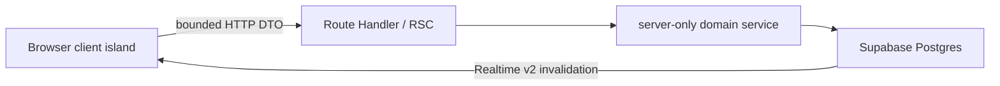

# NEXTUM LMS Architecture

## Runtime boundaries

NEXTUM LMS is a Next.js App Router web application. The root layout is intentionally
small. Public authentication lives under `/login` and invitation-only `/signup`; protected screens live in the
`(app)` route group.

The protected server layout validates the Supabase JWT and loads the active account,
academy membership, person, staff reference, and academy name once per request. It
passes a minimal serializable profile to the client shell. Feature components do not
query identity tables during hydration.

Browser-side Supabase usage is limited to authentication lifecycle and Realtime.
Business reads and writes run through server-only domain functions under
`src/lib/lms`, which are shared by Route Handlers and Server Components.



## Data ownership

This repository owns the shared Supabase schema, forward-only migrations, RLS
contracts, Data API exposure settings, and cross-app rollout documentation. Grade App
is a consumer of the identity, content, learning, and Realtime contracts; it must not
apply independent DDL or replace the PostgREST exposed-schema configuration.

Legacy `learning.*` content compatibility remains additive until Grade App has moved
to canonical `content.*`, contract smoke tests pass, and production access is zero for
the documented observation window. See [the Grade App impact contract](grade-app-optimization-impact.md)
for consumer work and [the Supabase v2 runbook](supabase-optimization-v2-runbook.md)
for deployment, verification, rollback, and removal gates.

## API contracts

- Long collections use keyset cursors, default 50 and maximum 100 rows.
- A cursor page contains `items`, `nextCursor`, and `hasMore`.
- Errors contain `code`, `message`, optional `fieldErrors`, and `requestId`.
- Mutation responses contain `data` plus `invalidation: { eventId, domains }`.
- Hot paths select explicit columns and never expose answer fields in student DTOs.
- Route Handlers own request authentication, origin/CSRF checks, and role checks;
  `/api` is excluded from the page-session proxy to avoid duplicate JWT validation.

## Cache and Realtime

The browser GET cache is bounded and expires by policy. Concurrent requests for the
same key share one in-flight promise, including forced refreshes. Mutations clear only
the affected academy/domain keys.

Cross-client invalidation uses the database as the remote source of truth. A mutation
updates its initiating tab once and signals other local tabs through BroadcastChannel
(localStorage is fallback only). Realtime v2 events use this shape:

```ts
{
  version: 2;
  eventId: string;
  academyId: string;
  domains: string[];
  entityType?: string;
  entityIds?: string[];
  coreStudentId?: string;
  occurredAt: string;
}
```

Clients deduplicate `eventId` and coalesce domains for 300 ms, so one logical change
causes at most one background refresh per academy window. The v1 adapter remains only
for the Grade App compatibility window.

## Deliberate removals

The desktop/Electron compatibility layer, global pointer-capture recovery, Zustand
stores, and PIN/idle-lock feature are not part of the current web architecture. The
PIN database table is deprecated and may be dropped only after the documented
rollback window. Historical design reports remain available through Git history;
current operational decisions belong in this document and the deployment runbook.
