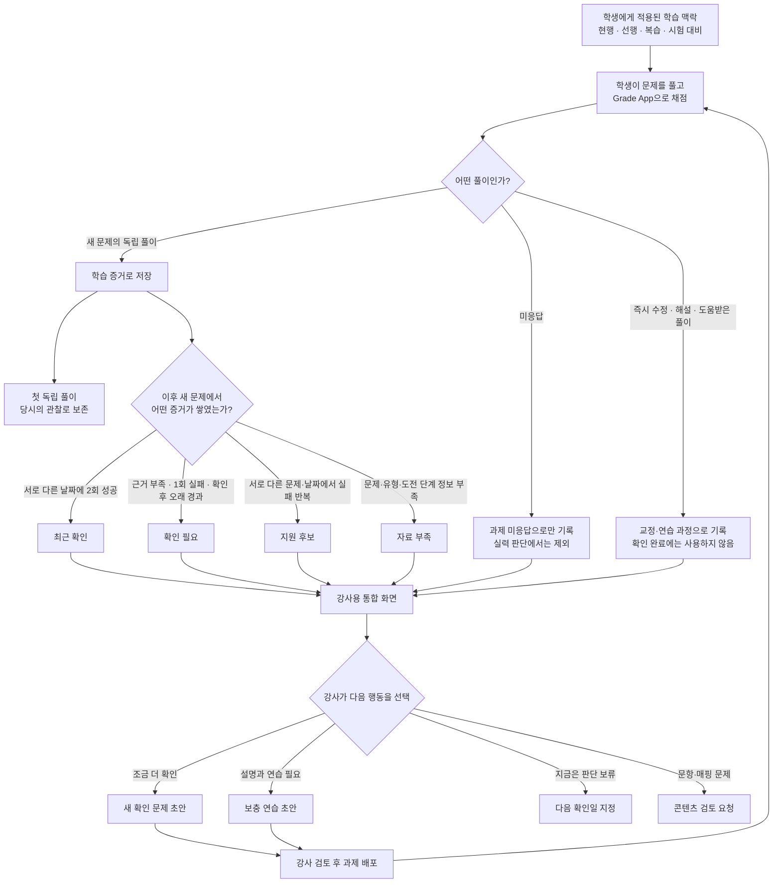
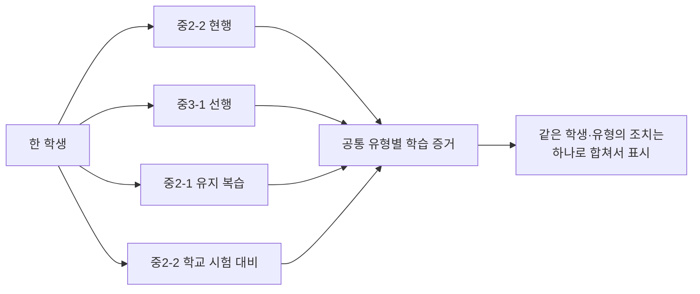
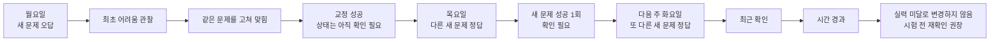

# 학습 증거 기반 학생 지원 시스템

> **처음 틀린 기록은 남기되, 이후 새로운 문제에서 나아진 모습까지 함께 보여주고, 강사가 다음에 무엇을 확인하거나 지원할지 알려주는 시스템**

---

## 전체 플로우 한눈에 보기

### 이 그림에서 기억할 핵심 다섯 가지

1. **처음 틀린 기록은 지우지 않는다.** 당시의 독립 풀이로 남긴다.
2. **고쳐 맞힌 것과 새 문제를 맞힌 것을 구분한다.** 둘 다 가치가 있지만 의미가 다르다.
3. **새 문제에서 반복해서 확인된 결과로 현재 상태를 본다.**
4. **학생 문제와 콘텐츠 부족을 분리한다.** 문제가 없으면 학생을 미준비로 보지 않는다.
5. **시스템은 후보를 제안하고 강사가 결정한다.** 자동으로 학생을 판정하거나 과제를 발송하지 않는다.

---

## 1. 이 시스템을 왜 만드는가

Grade App의 채점 데이터는 지금도 학생이 무엇을 맞히고 틀렸는지 알려준다. 하지만 단순 정답률만으로는 다음을 알기 어렵다.

- 처음에는 틀렸지만 이후 실제로 나아진 학생
- 같은 문제만 고쳐 맞혔을 뿐 새로운 문제에서는 아직 불안한 학생
- 문제를 풀지 않아 판단할 수 없는 학생
- 학생이 아니라 분석할 문항이나 유형 정보가 부족한 상황

우리가 원하는 것은 점수표가 아니라 **강사의 다음 행동을 줄여주는 지도**다.

> 누구에게, 어떤 유형을, 언제, 어떤 문제로 다시 확인할 것인가?

이 질문에 빠르게 답하는 것이 시스템의 목적이다.

---

## 2. 학생의 풀이를 세 종류로 나눈다

### A. 최초 독립 풀이

학생이 해설이나 도움 없이 처음 제출한 결과다.

- 맞든 틀리든 당시의 관찰로 보존한다.
- 나중에 고쳐도 최초 기록은 바꾸지 않는다.
- 다만 `학생의 본래 실력`이라고 단정하지 않는다.

권장 표현:

> 시스템에 처음 기록된 독립 풀이에서 어려움이 관찰됨

### B. 교정·연습 과정

틀린 문제를 고치거나 해설을 본 뒤 다시 푼 결과다.

- 학생이 학습에 참여하고 교정했다는 중요한 기록이다.
- 그러나 답이나 풀이를 기억했을 가능성이 있으므로 `최근 확인`을 완성하지는 않는다.

### C. 새로운 문제의 독립 확인

같은 유형의 다른 문제를 도움 없이 처음 푼 결과다.

- 학생이 실제로 나아졌는지 보는 가장 중요한 근거다.
- 한 문제의 우연을 줄이기 위해 서로 다른 문제와 날짜의 결과를 함께 본다.

---

## 3. 어떤 결과를 어떻게 해석하는가

| 학생의 행동 | 시스템에 남기는 의미 | 현재 확인에 반영 |
| --- | --- | --- |
| 새 문제를 독립적으로 풂 | 현재 수행을 보여주는 핵심 증거 | 반영 |
| 틀린 문제를 즉시 고쳐 맞힘 | 교정 성공 | 직접 반영하지 않음 |
| 같은 문제를 며칠 뒤 다시 맞힘 | 기억 유지·재인출 참고 | 보조 정보로만 표시 |
| 해설·힌트·AI 도움 후 맞힘 | 도움받은 학습 과정 | 직접 반영하지 않음 |
| 맞았지만 `확신 없음` | 불안정한 정답 | 추세에만 반영 |
| `모름`을 명시적으로 선택 | 이번 풀이에서 회상하지 못함 | 부정 증거로 반영 |
| 답을 제출하지 않음 | 판단할 수 없음 | 실력 분석 제외 |
| 소문항 일부만 맞힘 | 부분적으로 해결함 | 추세에만 반영 |

### 미응답은 오답이 아니다

답이 없으면 학생이 몰랐는지, 과제를 하지 않았는지, 시간이 부족했는지 판단할 수 없다.

따라서 미응답은 다음처럼 분리한다.

- 과제 화면: `미응답·미완료`로 표시
- 학습 분석: 정답·오답 계산에서 제외
- 확인 상태: 근거가 없으므로 필요한 경우 `확인 필요`로 남김

---

## 4. 현재 상태는 네 가지로만 보여준다

### ✅ 최근 확인

같은 유형의 새로운 문제를 서로 다른 날짜에 독립적으로 해결한 근거가 확보된 상태다.

기본 확인 조건:

- 새로운 문제 2개
- 서로 다른 날짜
- 목표 도전 단계와 일치
- 도움 없이 완전 정답
- `확신 없음`이 아님

`마스터`, `완전 숙달`처럼 영구적인 표현은 사용하지 않는다.

### 🔎 확인 필요

다음 중 하나에 해당한다.

- 아직 새 문제 근거가 없음
- 첫 실패 이후 확인이 충분하지 않음
- 최근 확인 뒤 새로운 오답이 한 번 나타남
- 마지막 확인 이후 시간이 지나 다시 볼 시점이 됨

### 🧩 지원 후보

서로 다른 문제와 날짜에서 독립적인 어려움이 반복된 상태다.

자동으로 `지원 필요 학생`으로 확정하지 않는다. 강사가 근거 문제를 확인한 뒤 설명, 연습, 재확인 중 무엇이 필요한지 결정한다.

### 📦 자료 부족

다음과 같은 이유로 판단할 수 없는 상태다.

- 해당 유형의 문제가 부족함
- 문제에 공통 유형이 연결되지 않음
- 목표 도전 단계 정보가 없음

자료 부족은 학생 상태가 아니라 콘텐츠 관리 항목이다.

### 단일 준비도 점수를 만들지 않는 이유

시험 범위가 20개 유형이라면 다음처럼 보여준다.

> **시험 범위 20개**  
> 최근 확인 8 · 확인 필요 4 · 지원 후보 2 · 자료 부족 6

이를 `준비도 40%`로 만들면 콘텐츠 부족까지 학생의 미준비처럼 보일 수 있다.

---

## 5. 학생은 여러 학습 맥락을 동시에 가질 수 있다

### 학습 트랙

현행, 선행, 복습처럼 계속 이어지는 학습 계획이다.

각 트랙에는 다음만 있으면 된다.

- 학습할 단원·유형 범위
- 목표 도전 단계
- 다시 확인할 주기
- 필요한 경우 연결할 교재·문제은행·학습지

**교재는 필수가 아니다.**

복습 트랙은 교재 없이도 만들 수 있다. 강사가 자체 프린트를 사용하거나 주기적으로 몇 문제만 숙제로 줄 수도 있다. 나중에 교재나 학습지를 연결하거나 교체해도 트랙 자체는 유지된다.

### 시험 계획

특정 시험을 위한 별도 계획이다.

- 대상 반
- 시험일
- 정확한 시험 범위
- 반의 기본 목표 도전 단계
- 필요한 학생만 목표 단계 예외 설정

학습 트랙과 시험 계획에 같은 유형이 들어 있다면 하나의 풀이 증거를 함께 활용한다.

---

## 6. 강사가 실제로 사용하는 방식

### 1단계. 범위를 정한다

강사는 `현행`, `선행`, `유지 복습` 중 하나를 고르고 단원 범위를 지정한다.

- 반 학생은 기본 설정을 함께 사용한다.
- 다른 진도가 필요한 학생만 예외로 바꾼다.
- 시험 대비는 시험일과 범위를 별도로 지정한다.

### 2단계. 평소처럼 채점한다

Grade App으로 채점하면 시스템이 다음을 자동 구분한다.

- 최초 독립 풀이
- 교정·복습 풀이
- 새로운 문제의 독립 풀이
- 미응답

강사가 과제를 만들 때마다 `어느 트랙용인지` 선택할 필요는 없다. 문제의 공통 유형을 기준으로 관련 트랙과 시험 계획에 자동 연결한다.

### 3단계. 통합 조치 화면을 본다

강사는 계획마다 다른 목록을 확인하지 않는다.

같은 학생·유형이 복습과 시험 대비에서 동시에 필요하면 하나로 합쳐 보여준다.

> 김민수 · 일차함수 그래프 해석  
> 시험 대비와 유지 복습에서 모두 재확인 필요

### 4단계. 근거를 열어본다

한 번의 클릭으로 다음을 확인한다.

- 처음 기록된 독립 풀이
- 고쳐 푼 과정
- 이후 새로운 문제 결과
- 문제를 푼 날짜와 도전 단계
- 왜 현재 상태가 되었는지

### 5단계. 다음 행동을 정한다

강사는 상황에 맞는 행동을 고른다.

- `새 문제로 확인하기`
- `설명 후 연습시키기`
- `다음 수업에서 관찰하기`
- `지금은 보류하기`
- `문항·유형 정보가 잘못됨`

시스템은 조건에 맞는 문제 초안을 제안하고, 강사가 검토한 뒤 배포한다. 자동 발송하지 않는다.

---

## 7. 교재·학습지·프린트는 이렇게 다룬다

### 기존 문제은행

유형과 도전 단계 정보가 있으므로 전체 분석이 가능하다.

### 유형 정보가 포함된 학습지

매핑된 문항만 분석한다. 배포 전에 다음처럼 알려준다.

> 전체 25문항 중 18문항 분석 가능

### 즉석 외부 프린트

사전 매핑 없이 바로 배포할 수 있다.

- 배포·완료·미응답은 관리한다.
- 공통 유형 상태에는 반영하지 않는다.
- 필요하면 나중에 유형 정보를 연결한다.

과제를 사용하기 위해 모든 콘텐츠 정리를 먼저 끝내도록 강요하지 않는다.

---

## 8. 학생 사례로 보는 상태 변화

민수는 중2-2를 복습하면서 중3-1을 선행하고 있다. 학교에서는 중2-2 시험도 준비 중이다.

이 과정에서 월요일의 최초 오답은 사라지지 않는다. 그러나 민수의 현재 상태도 최초 오답에 묶여 있지 않는다.

---

## 9. 앱에서 보게 될 핵심 화면

### 반 학습

- 현재 운영 중인 현행·선행·복습 트랙
- 오늘 확인할 학생과 유형
- 반복 어려움이 관찰된 지원 후보
- 다시 확인할 시점이 된 유형
- 확인·보충 과제 만들기

### 시험 대비

- 시험일과 정확한 범위
- 최근 확인·확인 필요·지원 후보·자료 부족 개수
- 학생별·유형별 현황
- 시험 전 최종 재확인 대상

### 학생 상세

- 처음 기록된 독립 풀이
- 현재 상태와 그 근거
- 교정·연습·독립 확인 타임라인
- 학생에게 적용된 현행·선행·복습·시험 계획
- 강사의 별도 관찰 기록

### 콘텐츠 관리

일반 강사의 일상 화면에서는 숨긴다.

- 공통 유형과 도전 단계 검수
- 같은 문제 중복 확인
- 자료가 부족한 유형
- 강사가 신고한 문항·매핑 오류

---

## 10. 반드시 지켜야 할 표현과 운영 원칙

| 사용하지 않을 표현 | 사용할 표현 |
| --- | --- |
| 이 학생은 이 유형을 못함 | 최근 독립 풀이에서 어려움이 관찰됨 |
| 최초 실력 | 시스템에 처음 기록된 독립 풀이 |
| 마스터함 | 최근 서로 다른 문제와 날짜에서 확인됨 |
| 지원 필요 확정 | 지원 후보·강사 확인 권장 |
| 21일이 지나 실력 미달 | 마지막 확인 이후 시간이 지나 재확인 권장 |
| 미응답 오답 | 미응답·실력 판단 제외 |
| 준비도 40% | 최근 확인 8·확인 필요 4·지원 후보 2·자료 부족 6 |

추가 원칙:

- 학생·학부모에게 자동으로 상태를 공개하지 않는다.
- 이 데이터를 성적이나 강사 평가에 사용하지 않는다.
- 학생·반·강사 순위를 만들지 않는다.
- 근거 문제를 보지 않고 자동으로 보충 대상으로 확정하지 않는다.
- 유형 반복 훈련 때문에 개념 설명과 종합 문제 학습이 줄어들지 않게 한다.

---

## 11. 처음에는 작게 검증한다

첫 운영은 다음 범위로 제한한다.

- 교재 1권
- 1~2개 반
- 시험 계획 1개
- 강사용 내부 화면
- 확인·보충 문제 초안까지 포함

처음에는 시스템 상태와 강사의 실제 판단을 비교한다. 다음 질문에 답할 수 있을 때 범위를 넓힌다.

- 시스템의 `확인 필요`가 실제로 확인할 가치가 있었는가?
- `지원 후보`를 강사가 보았을 때 동의할 수 있었는가?
- 잘못된 문항·유형 정보 때문에 생긴 오판은 없었는가?
- 강사의 분석·과제 준비 시간이 실제로 줄었는가?
- 학생에게 불필요한 확인 문제를 과도하게 주지는 않았는가?

---

## 12. 이 시스템이 궁극적으로 만들어야 하는 변화

이 시스템의 성공은 더 많은 점수와 그래프를 만드는 것이 아니다.

강사가 다음을 더 빠르게 할 수 있어야 한다.

- 처음 어려움을 보인 부분을 놓치지 않는다.
- 고쳐 맞힌 것과 실제로 나아진 것을 구분한다.
- 이미 나아진 학생에게 불필요한 반복을 줄인다.
- 반복해서 어려움을 보이는 학생을 적절한 시점에 돕는다.
- 시험 전 확인할 내용을 학생별로 좁힌다.
- 학생의 부족과 콘텐츠의 부족을 혼동하지 않는다.

> **학생을 판정하는 시스템이 아니라, 강사가 다음 확인과 지원을 놓치지 않게 하는 시스템.**

이것이 본 기획의 핵심이다.
